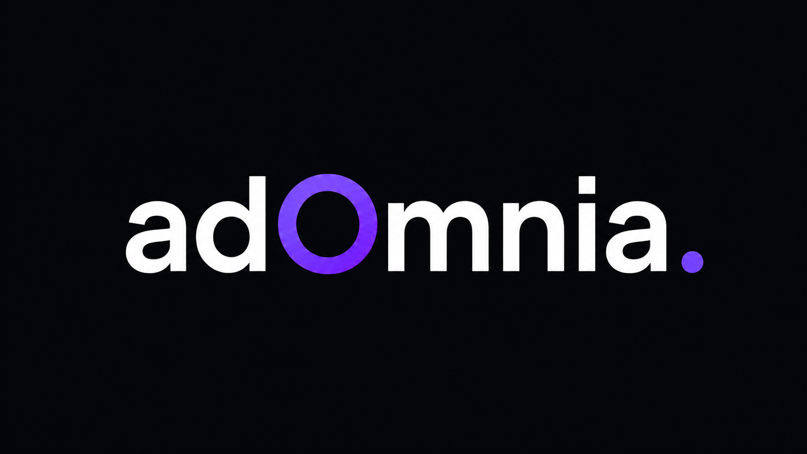
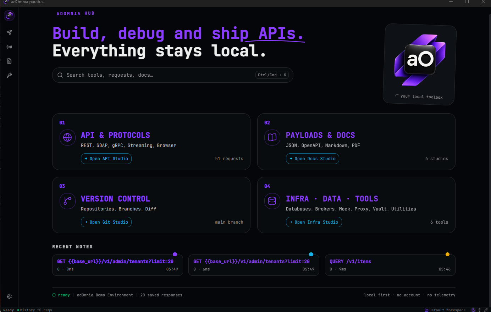

# adOmnia

**A local-first desktop toolbox for API development, backend integration, protocol debugging, and enterprise workflows.**

adOmnia brings together the tools backend engineers usually keep scattered across many apps: HTTP collections, environments, SOAP/WSDL, gRPC, WebSocket/SSE, broker clients, mock servers, proxy interception, browser debugging, database access, load testing, observability utilities, secret scanning, and local workspaces.

No account. No cloud sync. No telemetry. Your data stays on your machine.

> Built with **[Wails v2](https://wails.io)** — a Go + WebView desktop framework that compiles the entire app (Go backend + React frontend) into a single native executable with no Electron overhead and no runtime dependencies.



[](https://wails.io)
[](https://github.com/wailsapp/awesome-wails)


---

## Languages

- [English](#english)
- [Español](#español)
- [Italiano](#italiano)

---

## English

### Why adOmnia?



Modern integration work is bigger than sending HTTP requests. Real teams debug APIs, browsers, queues, databases, legacy SOAP services, certificates, environments, mocks, test datasets, and local infrastructure in the same day.

adOmnia is designed as a professional desktop command center for that work.

### Core Principles

| Principle | What it means |
|---|---|
| **Local-first** | Workspaces, settings, logs, vaults, templates, and app data are stored locally. |
| **Privacy-first** | No account, no telemetry, no hidden sync, no remote dependency for normal work. |
| **Extensible** | Themes, importable skins, workspace templates, WASM plugins, and Python plugin SDK. |
| **Enterprise-ready** | SOAP/WSDL, WS-Security, mTLS, certificates, brokers, legacy protocols, and regulated environments matter. |
| **Integrated debugging** | Browser debugging and API workflows live in one tool to reduce context switching. |

### Feature Highlights

| Area | Included |
|---|---|
| **API Workspace** | HTTP collections, tabbed requests, environments, variables, auth, scripts, assertions, response viewer, cURL import, OpenAPI import. |
| **Protocols** | SOAP/WSDL Studio, gRPC client, WebSocket client, WebSocket mock server, SSE client. |
| **Streaming & Brokers** | Kafka, RabbitMQ, MQTT, Redis, NATS, producer/consumer workflows, topic and message tooling. |
| **Simulation** | Mock server, proxy/interceptor, record and replay, Docker Lab presets, local dependency stacks. |
| **Debugging** | Browser debugging via Chrome DevTools Protocol, HAR viewer, network tools, CORS checks, DNS utilities, port scan. |
| **Data & Security** | Database Studio, storage inspector, encrypted vault, secret scanner, certificate and PEM/JKS tools. |
| **Productivity** | Runner, environment matrix, test data studio, load testing, JSON/XML tools, Markdown workspace notes. |
| **Customization** | Themes, Windows 95 skin, theme editor, global UI font setting, template marketplace, plugins. |

Full feature catalog: [docs/funzionalita.md](docs/funzionalita.md)

### Download

The easiest way to use adOmnia is to download the latest pre-built release — no build tools required.

**[Download latest release →](../../releases/latest)**

| Platform | File |
|---|---|
| Windows | `adOmnia-windows-amd64.zip` |
| Linux | `adOmnia-linux-amd64.tar.gz` |

Extract the archive and run the executable directly. No installation, no dependencies.

### Quick Start (build from source)

Only needed if you want to develop or modify adOmnia.

```bash
git clone <repository-url>
cd adomnia

cd frontend
npm install
cd ..

wails dev
```

Production build:

```bash
# Windows PowerShell
.\build.ps1

# macOS / Linux
./build.sh
```

Detailed build instructions: [docs/BUILD.md](docs/BUILD.md)

### Tech Stack

| Layer | Technology |
|---|---|
| Desktop shell | Wails 2 |
| Backend | Go |
| Frontend | React 18, TypeScript, Vite |
| State | Zustand |
| Styling | Tailwind CSS, CSS custom properties, theme tokens |
| Storage | bbolt and local workspace files |
| Distribution | Portable desktop binary |

### Project Structure

```text
.
├── main.go                      Wails entrypoint
├── app.go                       app lifecycle and desktop bindings
├── server.go                    local HTTP sidecar
├── mock.go                      mock server
├── proxy.go / proxy_*.go        proxy, traffic, CA, rules, export
├── browser_debug*.go            Chrome DevTools Protocol integration
├── kafka.go / broker.go         Kafka and multi-broker workflows
├── grpc.go                      gRPC backend
├── loadtest.go                  load testing engine
├── database_go.go               database integrations
├── dockerlab.go                 Docker Lab generator and runner
├── themes*.go                   theme and skin system
├── plugins*.go                  WASM plugin sandbox
├── python_*.go                  Python plugin bridge
├── frontend/                    React application
├── assets/images/               product artwork and icons
├── docker/adomnia-lab/          local demo lab
├── workspaces/                  sample .adomnia workspaces
└── docs/                        product, build, roadmap, and feature docs
```

### Workspaces

adOmnia uses portable `.adomnia` workspace files.

- Export/import from the Workspace panel.
- Keep workspaces in Git when useful.
- Drag and drop `.json`, `.yaml`, `.yml`, or `.adomnia` files into the app.
- Import Postman, Insomnia, Bruno, OpenAPI, and adOmnia workspace data.

### Security & Privacy

adOmnia is built for local and regulated workflows.

- No telemetry.
- No required cloud account.
- No hidden network sync.
- Secrets and workspaces stay local unless you explicitly export or send them.
- Script execution and certificate trust should be reviewed like any developer tool with local power.

Security policy: [.github/SECURITY.md](.github/SECURITY.md)

### Contributing

High-quality contributions are welcome. The best changes improve the real product experience: clearer workflows, better UI cohesion, stronger local-first behavior, safer integrations, and better documentation.

Recommended workflow:

1. Read [AGENTS.md](AGENTS.md) and [CLAUDE.md](CLAUDE.md) for project conventions.
2. Check [docs/TODO.md](docs/TODO.md) and [docs/adomnia-roadmap-checkbox.md](docs/adomnia-roadmap-checkbox.md) before starting larger work.
3. Keep changes focused and product-oriented.
4. Run the relevant checks before opening a pull request.
5. Document user-facing behavior changes.

### License

MIT. See [LICENSE.md](LICENSE.md).

Developed by Andrea Cavallo.

---

## Español

### ¿Qué es adOmnia?

adOmnia es una aplicación de escritorio local-first para desarrollo de APIs, integración backend y depuración de protocolos. No es solo un cliente HTTP: es un entorno completo para trabajar con servicios modernos, sistemas legacy, mocks, proxies, brokers, bases de datos y herramientas de diagnóstico.

No requiere cuenta. No tiene telemetría. No depende de la nube para tu trabajo diario.

### Para qué sirve

| Área | Capacidades |
|---|---|
| **APIs REST** | Colecciones, entornos, variables, autenticación, scripts, assertions, importación cURL y OpenAPI. |
| **Protocolos enterprise** | SOAP/WSDL, WS-Security, gRPC, WebSocket, SSE. |
| **Mensajería** | Kafka, RabbitMQ, MQTT, Redis y NATS. |
| **Depuración** | Proxy/interceptor, HAR viewer, DevTools del navegador, DNS, CORS y escaneo de puertos. |
| **Simulación** | Mock server, record/replay, Docker Lab y stacks locales. |
| **Datos locales** | Database Studio, storage inspector, vault cifrado, scanner de secretos. |
| **Personalización** | Temas, skins, selector global de fuente, plantillas y plugins. |

### Principios

- **Local-first:** tus datos viven en tu máquina.
- **Privacidad real:** sin telemetría, cuentas obligatorias o sincronización oculta.
- **Extensible:** temas, plantillas, plugins WASM y SDK Python.
- **Preparado para enterprise:** SOAP, certificados, brokers y sistemas legacy son ciudadanos de primera clase.
- **Producto de escritorio:** interfaz densa, rápida y pensada para trabajo técnico real.

### Descarga

La forma más sencilla de usar adOmnia es descargar la última versión precompilada — sin herramientas de compilación.

**[Descargar última versión →](../../releases/latest)**

| Plataforma | Archivo |
|---|---|
| Windows | `adOmnia-windows-amd64.zip` |
| Linux | `adOmnia-linux-amd64.tar.gz` |

Extrae el archivo y ejecuta directamente. Sin instalación, sin dependencias.

### Inicio rápido (compilar desde el código)

Solo necesario si quieres desarrollar o modificar adOmnia.

```bash
git clone <repository-url>
cd adomnia

cd frontend
npm install
cd ..

wails dev
```

Compilación:

```bash
.\build.ps1   # Windows
./build.sh    # macOS / Linux
```

Guía completa: [docs/BUILD.md](docs/BUILD.md)

### Documentación

- Catálogo completo de funcionalidades: [docs/funzionalita.md](docs/funzionalita.md)
- Filosofía de producto: [docs/SOUL.md](docs/SOUL.md)
- Roadmap del proyecto: [docs/adomnia-roadmap-checkbox.md](docs/adomnia-roadmap-checkbox.md)
- Tareas abiertas: [docs/TODO.md](docs/TODO.md)

### Licencia

MIT. Ver [LICENSE.md](LICENSE.md).

---

## Italiano

### Cos'è adOmnia?

adOmnia è un toolbox desktop local-first per sviluppo API, integrazione backend, debugging di protocolli e workflow enterprise. Non è soltanto un HTTP client: è un ambiente unico per REST, SOAP/WSDL, gRPC, WebSocket, broker, mock server, proxy, browser debugging, database, load testing e strumenti di analisi.

Nessun account. Nessuna telemetria. Nessuna dipendenza cloud per lavorare.

### Perché usarlo

| Area | Cosa offre |
|---|---|
| **API Workspace** | Collezioni HTTP, tab richieste, ambienti, variabili, auth, scripts, assertions, import cURL e OpenAPI. |
| **Enterprise & Legacy** | SOAP/WSDL Studio, WS-Security, gRPC, mTLS, certificati e protocolli non sempre supportati dai tool mainstream. |
| **Streaming & Broker** | Kafka, RabbitMQ, MQTT, Redis, NATS e workflow producer/consumer. |
| **Debugging** | Proxy/interceptor, HAR viewer, Browser Debug via Chrome DevTools Protocol, DNS, CORS e port scan. |
| **Simulazione locale** | Mock server, record/replay, Docker Lab e stack locali pronti per test. |
| **Dati e sicurezza** | Database Studio, storage inspector, vault cifrato, secret scanner, tool PEM/JKS. |
| **Personalizzazione** | Temi, skin Windows 95, font UI globale, template marketplace e plugin. |

### Filosofia del progetto

- **Local-first:** workspace, impostazioni, log e dati restano sulla macchina.
- **Privacy-first:** niente account obbligatori, niente telemetria, niente sync nascosto.
- **Estendibile:** temi, skin, template, plugin WASM e SDK Python.
- **Enterprise-ready:** SOAP, certificati, broker e legacy sono trattati come casi reali, non eccezioni.
- **Product-first:** l'obiettivo è un'app desktop professionale, coerente e utile nel lavoro quotidiano.

### Download

Il modo più semplice per usare adOmnia è scaricare l'ultima release precompilata — nessun tool di build richiesto.

**[Scarica l'ultima release →](../../releases/latest)**

| Piattaforma | File |
|---|---|
| Windows | `adOmnia-windows-amd64.zip` |
| Linux | `adOmnia-linux-amd64.tar.gz` |

Estrai l'archivio ed esegui direttamente il binario. Nessuna installazione, nessuna dipendenza.

### Avvio rapido (build da sorgente)

Necessario solo se vuoi sviluppare o modificare adOmnia.

```bash
git clone <repository-url>
cd adomnia

cd frontend
npm install
cd ..

wails dev
```

Build:

```bash
.\build.ps1   # Windows
./build.sh    # macOS / Linux
```

Istruzioni complete: [docs/BUILD.md](docs/BUILD.md)

### Documentazione utile

- Catalogo funzionalità: [docs/funzionalita.md](docs/funzionalita.md)
- Visione prodotto: [docs/SOUL.md](docs/SOUL.md)
- Roadmap del progetto: [docs/adomnia-roadmap-checkbox.md](docs/adomnia-roadmap-checkbox.md)
- Coda lavori e bug aperti: [docs/TODO.md](docs/TODO.md)

### Licenza

MIT. Vedi [LICENSE.md](LICENSE.md).

---

## Repository Quality Notes

This repository aims to be easy to scan, evaluate, run, and contribute to:

- Clear product positioning at the top.
- Honest local-first and privacy claims.
- Build instructions close to the top.
- Feature catalog linked instead of duplicated endlessly.
- Multilingual overview for a wider contributor base.
- Security, license, contribution, and documentation links included.
