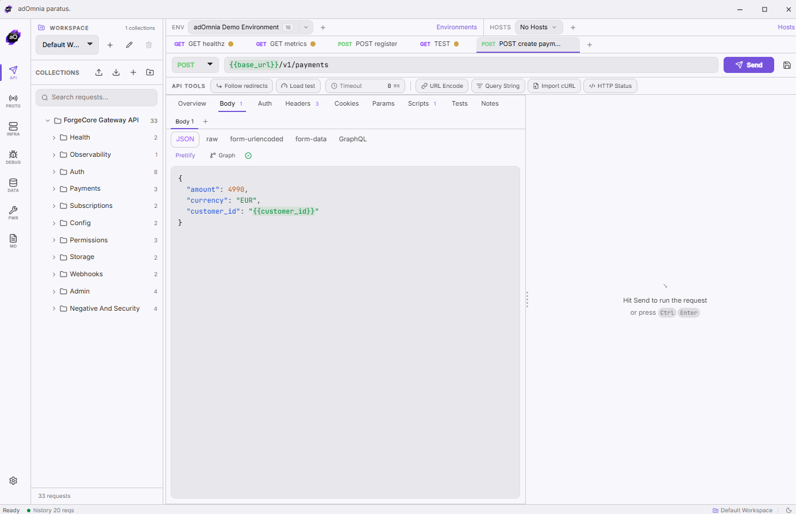

# adOmnia

**The professional API toolbox that lives entirely on your machine.**

REST · gRPC · SOAP · GraphQL · WebSocket · SSE · Kafka · RabbitMQ · MQTT · Redis · NATS  
Mock servers · HTTPS proxy · Browser DevTools · Load testing · Database Studio · Encrypted vault  
AI mock generation · Git Sync · MCP Client · WASM + Python plugins · 11 themes

> No account. No telemetry. No subscription. One portable executable. **444+ features.**

> Proudly listed on **[Awesome Wails](https://github.com/wailsapp/awesome-wails)** and **[Awesome HTTP Clients](https://github.com/mrmykey/awesome-http-clients/tree/main)**.

[](https://www.adomnia-dev.com)
[](https://github.com/wailsapp/awesome-wails)
[](https://github.com/mrmykey/awesome-http-clients/tree/main)


---

## Languages · Idiomas · Lingue
[English](#english) · [Español](#español) · [Italiano](#italiano)

---

## English

### ⬇️ Download

**[→ Go to Releases](../../releases/latest)** and download the file for your platform. No installation required.

| Platform | File | Steps |
|---|---|---|
| Windows | `adOmnia-*-windows-amd64.exe` | Download → double-click → done |
| macOS | `adOmnia-*-macos-universal.dmg` | Download → open DMG → drag to Applications |
| Linux | `adOmnia-*-linux-amd64.AppImage` | Download → `chmod +x` → double-click or run |

No dependencies. The Linux AppImage bundles everything and runs on any distro out of the box.

---


or white skin:


### What is adOmnia

adOmnia is a **professional-grade API development toolbox** built for developers who demand privacy, power, and zero vendor lock-in. It replaces Postman, Insomnia, Charles Proxy, browser DevTools, a database client, and a secrets manager — with a single portable executable that never phones home.

check rest apis: 





**444+ features across 7 categories:**

| Area | What you get |
|---|---|
| **API Workspace** | Multiple local workspaces with independent collections and tabs, HTTP client (all methods), environments, `{{variable}}` substitution, OAuth2 PKCE, AWS Signature v4, Digest, cURL/OpenAPI import, scripts, assertions, code generation, response history |
| **API Catalog** | Installable public REST API starters, including curated no-auth/free endpoints inspired by `public-apis/public-apis`, imported directly into local adOmnia collections |
| **Collection Runner & Testing** | Test runner with iterations/delay/retry/CSV datasets, assertion editor (JSONPath, XPath, schema), Mermaid-generated API flows, test data studio (fake data generator) |
| **Protocols** | SOAP/WSDL Studio (1.1 & 1.2, WS-Security), gRPC (server reflection, unary + streaming), WebSocket client + mock server, SSE client, **MCP Client** (AI tool testing, stdio + HTTP transport) |
| **Brokers** | Kafka (produce/consume/bulk/load test), RabbitMQ, MQTT, Redis Pub/Sub, NATS — shared message log, persistent connection profiles |
| **Simulation & Infrastructure** | Mock server (pattern matching, record & replay, round-robin), HTTPS proxy/interceptor (MITM CA, breakpoints, map local/remote, throttling), Docker Lab (14 presets), load testing (HTTP + gRPC, HDR histogram, P99, side-by-side comparison) |
| **Debugging & Analysis** | Browser DevTools via CDP (network, console, JS debugger, DOM inspector, storage, screenshots), HAR viewer, DNS lookup/trace/compare, port scanner, CORS tester, JSON/XML/YAML tools, observability panel, secret scanner |
| **Data, Security & Extensibility** | Database Studio (SQLite/PostgreSQL/MySQL/MongoDB), bbolt storage inspector, encrypted vault (age/scrypt), **Git Sync** (commit/push/pull to any repo), **AI engine** (Anthropic/OpenAI/Gemini/Ollama — AI mock generation), WASM plugin sandbox, Python Plugin SDK, 11 built-in themes + custom skin system |

### Download

**[→ Go to Releases](../../releases/latest)** and download the file for your platform. No installation required.

| Platform | File | Steps |
|---|---|---|
| Windows | `adOmnia-*-windows-amd64.exe` | Download → double-click → done |
| macOS | `adOmnia-*-macos-universal.dmg` | Download → open DMG → drag to Applications |
| Linux | `adOmnia-*-linux-amd64.AppImage` | Download → `chmod +x` → double-click or run |

No installation, no dependencies. The Linux AppImage bundles everything (including WebKitGTK) — it runs on any distro out of the box.

### Build from source

Only needed if you want to compile it yourself. Requires Go, Node.js, and Wails.

```bash
git clone https://github.com/Andrea-Cavallo/adOmnia.git && cd adomnia
cd frontend && npm install && cd ..
wails dev          # dev mode
.\build.ps1        # Windows production build
bash build/build-wails.sh linux  # Linux production build
```

Full instructions: [docs/BUILD.md](docs/BUILD.md)

### License

MIT © Andrea Cavallo — [LICENSE.md](LICENSE.md).

---

## Español


### Qué es adOmnia

adOmnia es un **toolbox profesional de desarrollo de APIs** para desarrolladores que exigen privacidad, potencia y cero dependencia de la nube. Reemplaza Postman, Insomnia, un proxy HTTPS, DevTools del navegador, un cliente de base de datos y un gestor de secretos — todo en un único ejecutable portable que nunca envía datos.

**444+ funciones en 7 categorías:**

| Área | Qué incluye |
|---|---|
| **API Workspace** | Workspaces locales múltiples con colecciones y pestañas independientes, cliente HTTP completo, entornos, sustitución `{{variable}}`, OAuth2 PKCE, AWS v4, import cURL/OpenAPI, scripts, assertions, generación de código |
| **Testing y Runner** | Runner con iteraciones/delay/CSV, assertion editor (JSONPath, XPath, schema), flows API desde Mermaid, test data studio |
| **Protocolos** | SOAP/WSDL Studio (WS-Security), gRPC (reflection + streaming), WebSocket + mock server, SSE, **MCP Client** (prueba servidores MCP de IA) |
| **Mensajería** | Kafka, RabbitMQ, MQTT, Redis Pub/Sub, NATS — log compartido, perfiles persistentes |
| **Simulación e Infraestructura** | Mock server (record & replay, round-robin), proxy HTTPS (MITM CA, breakpoints, throttling), Docker Lab (14 presets), load testing (HTTP + gRPC, P99, HDR histogram) |
| **Debugging y Análisis** | Browser DevTools vía CDP (red, consola, debugger JS, DOM, storage, screenshots), HAR viewer, DNS, port scanner, CORS tester, herramientas JSON/XML, secret scanner |
| **Datos, Seguridad y Extensibilidad** | Database Studio (SQLite/PostgreSQL/MySQL/MongoDB), vault cifrado (age/scrypt), **Git Sync**, **IA** (Anthropic/OpenAI/Gemini/Ollama — generación de mocks), plugins WASM, SDK Python, 11 temas |

### Descarga

**[→ Ir a Releases](../../releases/latest)** y descarga el archivo para tu plataforma. Sin instalación.

| Plataforma | Archivo | Pasos |
|---|---|---|
| Windows | `adOmnia-*-windows-amd64.exe` | Descarga → doble clic → listo |
| macOS | `adOmnia-*-macos-universal.dmg` | Descarga → abre el DMG → arrastra a Aplicaciones |
| Linux | `adOmnia-*-linux-amd64.AppImage` | Descarga → `chmod +x` → doble clic o ejecuta |

Sin instalación, sin dependencias. El AppImage incluye todo (WebKitGTK incluido) y funciona en cualquier distribución.

### Compilar desde el código fuente

Solo necesario si quieres compilarlo tú mismo. Requiere Go, Node.js y Wails.

```bash
git clone https://github.com/Andrea-Cavallo/adOmnia.git && cd adomnia
cd frontend && npm install && cd ..
wails dev
.\build.ps1        # Windows
bash build/build-wails.sh linux  # Linux
```

Guía completa: [docs/BUILD.md](docs/BUILD.md)

### Licencia

MIT © Andrea Cavallo — [LICENSE.md](LICENSE.md).

---

## Italiano


### Cos'è adOmnia

adOmnia è un **toolbox professionale per lo sviluppo di API** pensato per chi vuole potenza, privacy e zero dipendenza dal cloud. Sostituisce Postman, Insomnia, un proxy HTTPS, i DevTools del browser, un client database e un gestore di segreti — in un unico eseguibile portatile che non invia mai dati fuori dalla tua macchina.

**444+ funzionalità in 7 categorie:**

| Area | Cosa include |
|---|---|
| **API Workspace** | Workspace locali multipli con collection e tab indipendenti, client HTTP completo, ambienti, sostituzione `{{variabile}}`, OAuth2 PKCE, AWS Signature v4, import cURL/OpenAPI, script, assertion, generazione codice |
| **Testing e Runner** | Runner con iterazioni/delay/CSV, assertion editor (JSONPath, XPath, schema), flow API generati da Mermaid, test data studio |
| **Protocolli** | SOAP/WSDL Studio (WS-Security), gRPC (server reflection + streaming), WebSocket + mock server, SSE, **MCP Client** (test server MCP per IA) |
| **Broker** | Kafka, RabbitMQ, MQTT, Redis Pub/Sub, NATS — log messaggi condiviso, profili connessione persistenti |
| **Simulazione e Infrastruttura** | Mock server (record & replay, round-robin), proxy HTTPS (MITM CA, breakpoint, map local/remote, throttling), Docker Lab (14 preset), load testing (HTTP + gRPC, P99, istogramma HDR) |
| **Debugging e Analisi** | Browser DevTools via CDP (rete, console, debugger JS, DOM, storage, screenshot), HAR viewer, DNS, port scanner, CORS tester, strumenti JSON/XML, secret scanner |
| **Dati, Sicurezza e Estendibilità** | Database Studio (SQLite/PostgreSQL/MySQL/MongoDB), vault cifrato (age/scrypt), **Git Sync**, **AI engine** (Anthropic/OpenAI/Gemini/Ollama — generazione mock AI), plugin WASM, SDK Python, 11 temi + skin custom |

### Download

**[→ Vai alle Releases](../../releases/latest)** e scarica il file per la tua piattaforma. Nessuna installazione richiesta.

| Piattaforma | File | Passi |
|---|---|---|
| Windows | `adOmnia-*-windows-amd64.exe` | Scarica → doppio clic → fatto |
| macOS | `adOmnia-*-macos-universal.dmg` | Scarica → apri il DMG → trascina in Applicazioni |
| Linux | `adOmnia-*-linux-amd64.AppImage` | Scarica → `chmod +x` → doppio clic o avvia da terminale |

Nessuna installazione, nessuna dipendenza. L'AppImage porta tutto dentro (WebKitGTK incluso) — funziona su qualsiasi distro senza installare nulla.

### Build da sorgente

Solo se vuoi compilarlo tu. Richiede Go, Node.js e Wails.

```bash
git clone https://github.com/Andrea-Cavallo/adOmnia.git && cd adomnia
cd frontend && npm install && cd ..
wails dev
.\build.ps1        # Windows
bash build/build-wails.sh linux  # Linux
```

Guida completa: [docs/BUILD.md](docs/BUILD.md)

### Licenza

MIT © Andrea Cavallo — [LICENSE.md](LICENSE.md).

---

Special thanks to:
- https://github.com/albertize
- https://github.com/plunix
