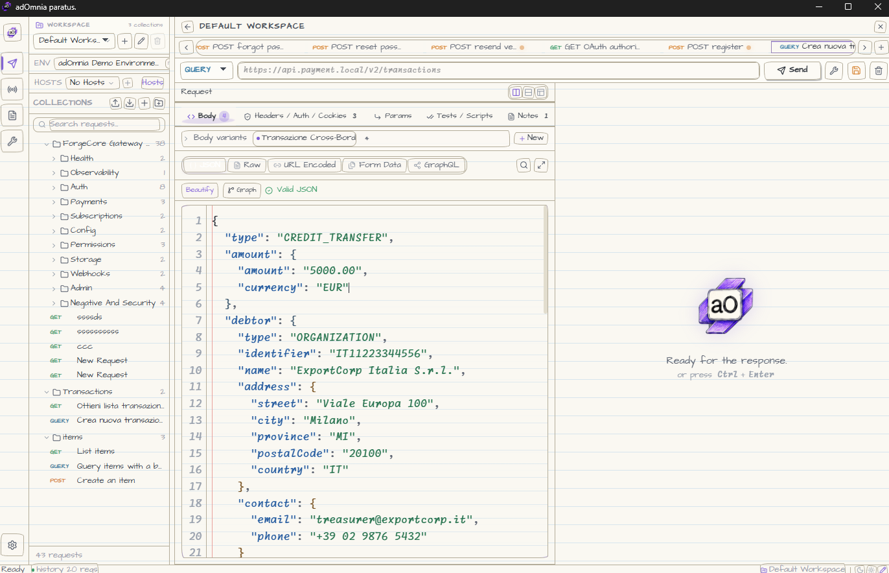
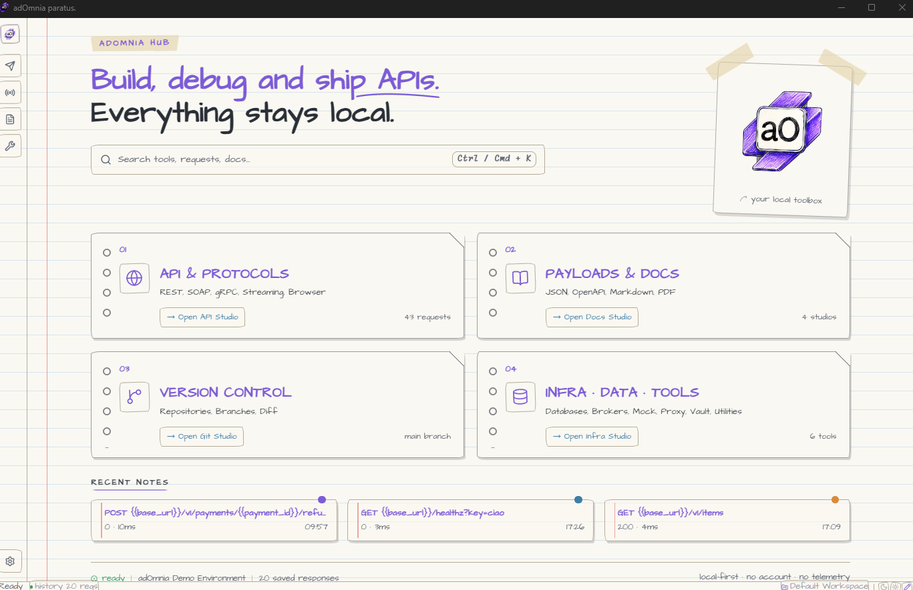
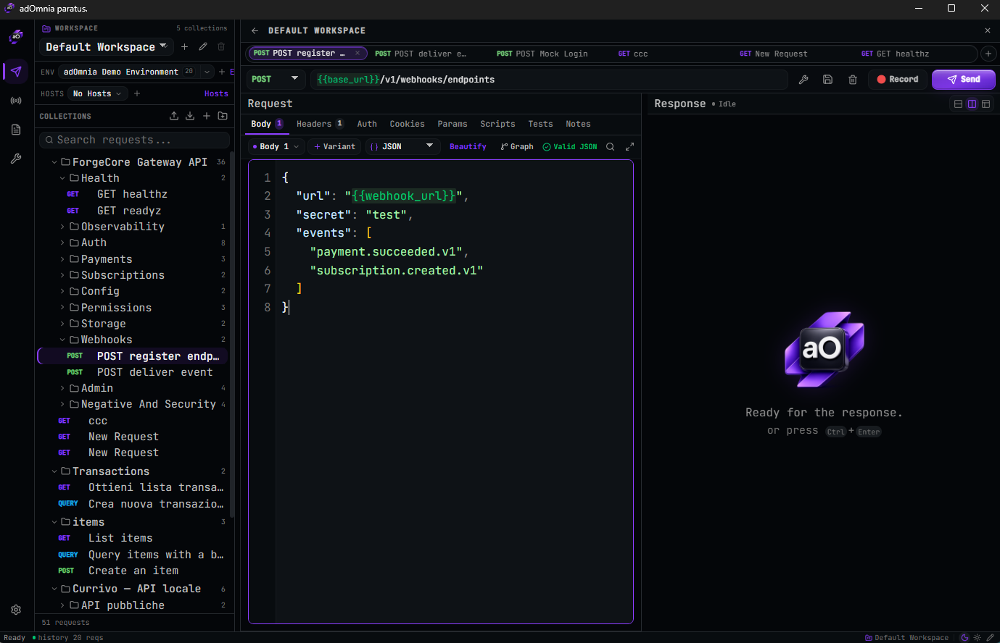

# adOmnia


**The entire API toolchain — REST to Kafka, mock to MITM proxy, database to PDF signing — in one portable app that never leaves your machine.**

REST · gRPC · SOAP · GraphQL · WebSocket · SSE · Kafka · RabbitMQ · MQTT · Redis · NATS
Mock servers · HTTPS proxy · Browser DevTools · Load testing · Database Studio · Encrypted vault
**Full Git client** (commit graph, push/pull, branch & conflict resolution) · OpenAPI design · Visual test builder · AI mock generation
MCP Client + Server Generator · Versionable collection folders · Headless runner · OpenAPI lint CLI · PDF & LaTeX Studio · Executable JS plugins · 11 themes

> **Stop paying a subscription to send an HTTP request.** No account. No cloud. No telemetry. One executable, **507+ features**, your data stays yours.

> Proudly listed on **[Awesome Wails](https://github.com/wailsapp/awesome-wails)** and **[Awesome HTTP Clients](https://github.com/mrmykey/awesome-http-clients/tree/main)**.

[](https://www.adomnia-dev.com)
[](https://github.com/wailsapp/awesome-wails)
[](https://github.com/mrmykey/awesome-http-clients/tree/main)


---


or white skin:


or the new Sketch skin, for a hand-drawn engineering-notebook workspace without giving up the desktop workflow:



The Sketch skin also gives the main adOmnia Hub a focused engineering-notebook layout, so API, documentation, Git, and infrastructure workspaces are immediately discoverable:



### Why adOmnia

Most API tools went the wrong way: they moved your requests, secrets, and history into someone else's cloud, put your team behind a login wall, and charged you monthly for it. adOmnia is the opposite bet — **one fast desktop app that does more than the cloud suites, while keeping everything on your machine.**

It replaces a whole shelf of tools:

> **Postman + Insomnia + Charles/Fiddler + browser DevTools + a database client + a SOAP/WSDL tool + a load tester + a secrets manager + a PDF signer** — collapsed into a single portable executable that never phones home.

Four things set it apart — and **no other tool combines all four**:

-  **Local-first, for real** — no account, no telemetry, no cloud sync. Your collections, secrets, and traffic never leave your disk. Workspaces stay local, collections can be exported as deterministic folder trees, and a **built-in Git client** (visual commit graph, branch/merge, push/pull, conflict resolution) versions them without ever leaving the app.
-  **Browser debugging built in** — inspect and debug real web pages (network, console, JS debugger, DOM, storage) *inside* the same tool you test APIs with. No competitor does this.
-  **Enterprise & legacy as first-class citizens** — SOAP/WSDL with WS-Security, mTLS, PKCS#12/JKS, gRPC streaming, and **real eIDAS-grade PDF digital signatures** (TSA timestamping + LTV). The boring-but-critical stuff Postman ignores.
-  **Yours to extend** — executable local JavaScript plugins, importable skins, shareable templates, and 11 built-in themes.

check rest apis:



### ⬇️ Download

**[→ Go to Releases](https://github.com/Andrea-Cavallo/adOmnia/releases/latest)** and grab the file for your platform. No installation, no dependencies.

| Platform | File |
|---|---|
| Windows | `adOmnia-*-windows-amd64.exe` |
| macOS | `adOmnia-*-macos-universal.dmg` |
| Linux (GTK 3 / WebKitGTK 4.1) | `adOmnia-*-linux-amd64-gtk3-webkitgtk-4.1.tar.gz` |

All releases include `SHA256SUMS.txt` and source code archives. Verify your download with the published checksums.

### What you get — 507+ features across 11 areas

| Area | What you get |
|---|---|
| **API Workspace** | Multiple local workspaces with independent collections and tabs, HTTP client (all methods), environments, `{{variable}}` substitution, OAuth2 PKCE, AWS Signature v4, Digest, cURL/OpenAPI import, scripts, assertions, code generation, response history, deterministic collection-folder export/import |
| **API Design (spec-first)** | Native OpenAPI 3.x / Swagger 2.x import (file/URL/paste) and round-trip export (JSON/YAML), **Visual OpenAPI Editor** (form-based endpoints, no YAML), **API Docs / Swagger viewer** with integrated governance findings, local OpenAPI linting in the desktop UI and CI |
| **API Catalog** | Installable public REST API starters, including curated no-auth/free endpoints inspired by `public-apis/public-apis`, imported directly into local adOmnia collections |
| **Collection Runner & Testing** | Test runner with iterations/delay/retry/CSV datasets, assertion editor (JSONPath, XPath, schema), Mermaid-generated API flows, **no-code Visual Test builder** (block-based, export to Flow), **response schema/contract validation**, test data studio, and a headless `adomnia run` CLI for folder-backed collections with CLI/JSON/JUnit reports |
| **Protocols** | SOAP/WSDL Studio (1.1 & 1.2, WS-Security), gRPC (reflection, offline proto/protoset authoring, unary calls, live cancellable streaming, TLS/mTLS, metadata, trailers, reproducible history and load tests), WebSocket client + mock server, SSE client, **MCP Client/Debugger** + **MCP Server Generator** (collection/OAS → runnable MCP server; stdio multi-session + HTTP transport) |
| **Brokers** | Kafka (produce/consume/bulk/load test), RabbitMQ, MQTT, Redis Pub/Sub, NATS — shared message log, persistent connection profiles |
| **Simulation & Infrastructure** | Mock Server Control Room with **Smart Mock Engine** (schema-driven Faker generation), **conditional expectations** (per-field matching), request-focused **Mock this tab** handoff, endpoint explorer, decision-aware traffic, record & replay and round-robin; HTTPS proxy/interceptor (MITM CA, breakpoints, map local/remote, throttling), Docker Lab (14 presets), load testing (HTTP + gRPC, HDR histogram, P99, side-by-side comparison) |
| **Debugging & Analysis** | Browser DevTools via CDP (network, console, JS debugger, DOM inspector, storage, screenshots), HAR viewer, DNS lookup/trace/compare, port scanner, CORS tester, JSON/XML/YAML tools, observability panel, secret scanner |
| **Document & Productivity Studio** | **PDF Editor** (view, annotate, fill forms, flatten/export) with **real cryptographic signing** — PEM or PKCS#12/JKS keystore import, RFC-3161 **TSA timestamping**, and **LTV** (chain + OCSP/CRL); **LaTeX Studio** (live `.tex` editor + preview + templates); Markdown studio; Mermaid diagrams |
| **Version Control (built-in Git)** | Full Git client inside the app — clone/init, stage & commit, **visual commit graph** with per-commit context actions (checkout, revert, reset, cherry-pick), branch create/switch/merge, push/pull to any remote, diff viewer, and **interactive conflict resolution**. Export collections as folder-backed, diff-friendly trees, import them back, and check drift between the app state and the files on disk |
| **Data, Security & Extensibility** | Database Studio (SQLite/PostgreSQL/MySQL/MongoDB), bbolt storage inspector, encrypted vault (age/scrypt), **AI engine** (Anthropic/OpenAI/Gemini/Hugging Face/Ollama) with guided cloud/local setup, live model discovery, local metadata cache and Vault or machine-local environment credentials, permission-aware JavaScript plugin runtime, 11 built-in themes + custom skin system |

Persistent Git, broker, and database credentials use encrypted `vault:` references. Plaintext credentials remain in memory for the current session only, are resolved immediately before use, and are automatically redacted from workspace, bucket, settings, and snapshot exports.

### Mock the request you are working on

From an open request tab, choose **Mock this tab**. adOmnia opens the Mock Server directly on that endpoint in a focused scope: existing mock definitions stay saved, but only the selected request is active until you choose **Show all endpoints**. If the server is already running, the focused configuration is applied live without changing its port.

The Traffic view explains what happened for each call: the matched endpoint and response, or a useful reason such as a missing mock response, authentication failure, CORS preflight, or no matching route.

### AI credentials from the local machine

In **Settings → AI Engine**, enable **Use system environment credentials** to bypass the Vault for AI connections. The desktop backend reads the key only from the environment inherited by adOmnia; it is never returned to the UI or saved in Settings.

Supported variables include `OPENAI_API_KEY`, `ANTHROPIC_API_KEY`, `GEMINI_API_KEY` / `GOOGLE_API_KEY`, `HUGGINGFACE_API_KEY` / `HF_TOKEN`, `OPENAI_COMPATIBLE_API_KEY`, and the generic fallback `ADOMNIA_AI_API_KEY`. On Windows, restart adOmnia after changing a user or system environment variable.

### Smart model setup, still local-first

The AI Engine offers goal-based profiles (recommended, best quality, efficient, or private local AI) while leaving the exact model under your control. adOmnia can ask the selected provider or local runtime which models are available, then saves only model metadata and the check time on your machine. Optional automatic checks run only when you open the AI Engine and only after you enable them; adOmnia does not send model data, prompts, or telemetry to its own servers and never changes your selected model silently.

### Version collections as folders

adOmnia keeps the desktop workspace fast and local, but collections can also be projected to a plain folder format for review, Git history, and CI:

```text
adomnia.collection.json
collection.json
folders/
  001-auth/
    folder.json
    001-login.request.json
  002-users/
    001-list-users.request.json
.adomnia-sync.json
```

From **Git Sync → Collection Folder** you can:

- export the selected collection to a deterministic folder tree
- import a folder-backed collection into the current workspace
- check drift between the in-app collection and the files on disk

Folder-backed collections can also carry shared auth, headers, variables, and scripts at collection/folder level. The headless runner resolves auth, headers, and variables top-down so common bearer tokens, tenant headers, and CI variables do not need to be duplicated in every request; scripts are preserved in the folder format while headless script parity remains in progress.

### Headless runner

The same desktop executable can run folder-backed collections without opening the UI:

```bash
adomnia run ./my-collection --env prod --folder "Smoke" --reporter junit --out report.xml --bail
```

Supported today:

- full collection or folder-scoped execution with `--folder`
- collection-local `.env` loading, ignored by Git by default
- environment file loading from `environments/<name>.json` with `--env`
- overrides with `--env-var KEY=VALUE`; precedence is collection variables, `.env`, named environment, then CLI override
- CLI, JSON, and JUnit reports
- non-zero exit code on request/assertion failure
- shared request resolution for variables, path params, query/header/body values, simple auth, and headless assertions
- OAuth2 `client_credentials`, password, and refresh-token grants plus AWS Signature v4
- run-scoped cookie jar, multipart fields, and `@file:<path>` file parts
- sandboxed pre/post/test scripts with `pm.environment`, `pm.response`, `pm.test`, and `pm.expect`
- OpenAPI response-contract checks when the collection carries an `openapiSpec`
- Vault references supplied safely in CI through `ADOMNIA_VAULT_<VARIABLE_NAME>` environment variables

Interactive OAuth authorization still belongs to the desktop browser flow. Headless runs intentionally reject authorization-code/PKCE interaction and direct users to a refresh token or non-interactive grant. Vault ciphertext is never decrypted or printed by the CLI; CI injects the plaintext value only into process memory through the matching `ADOMNIA_VAULT_*` variable.

Environments can be marked **Private** in the environment editor. Private environments remain in local bbolt storage and are excluded from collection-folder and workspace-file exports. Public environment secrets are exported only as empty placeholders.

In Git Sync, **Export** refreshes the complete deterministic collection folder, while **Request** updates only the currently open request file. Incremental export requires an existing folder projection so file names and ordering remain stable.

### OpenAPI lint in CI

Lint an OpenAPI file, or a folder-backed adOmnia collection that contains an `openapiSpec` in `collection.json`:

```bash
adomnia lint ./openapi.yaml --reporter json --out lint-report.json
adomnia lint ./my-collection --ruleset adomnia.oaslint.json --fail-on-warn
```

The built-in local rules check operation IDs, summaries/descriptions, response coverage, JSON response schemas, tags, security requirements, path naming, and duplicate operation IDs. `error` findings return a non-zero exit code; warnings are non-blocking unless `--fail-on-warn` is set.

The same engine is available in **API Docs > Governance**. It shows error/warning/info badges, searchable findings, operation navigation, and a local JSON ruleset whose overrides are persisted only on the machine.

### Build from source

Only needed if you want to compile it yourself. Requires **Go 1.26.5+**, **Node.js 22.13.0+**
and the **Wails 3 CLI** (`wails3`). On Linux you also need `libgtk-3-dev` and
`libwebkit2gtk-4.1-dev`.

```bash
git clone https://github.com/Andrea-Cavallo/adOmnia.git && cd adomnia
go install github.com/wailsapp/wails/v3/cmd/wails3@v3.0.0-beta.5
cd frontend && npm install && cd ..
wails3 task dev      # dev mode
wails3 task build    # production build for the current platform
```

Full instructions: [docs/BUILD.md](docs/BUILD.md)

### License

MIT © Andrea Cavallo — [LICENSE.md](LICENSE.md).

---

Special thanks to:
- https://github.com/albertize
- https://github.com/plunix
