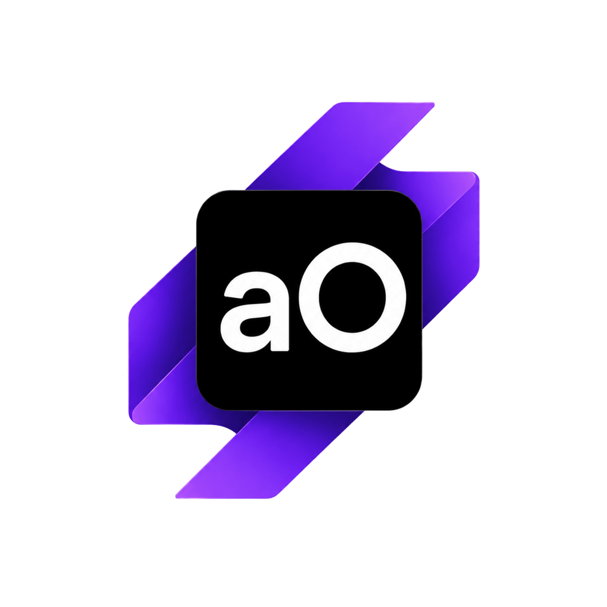
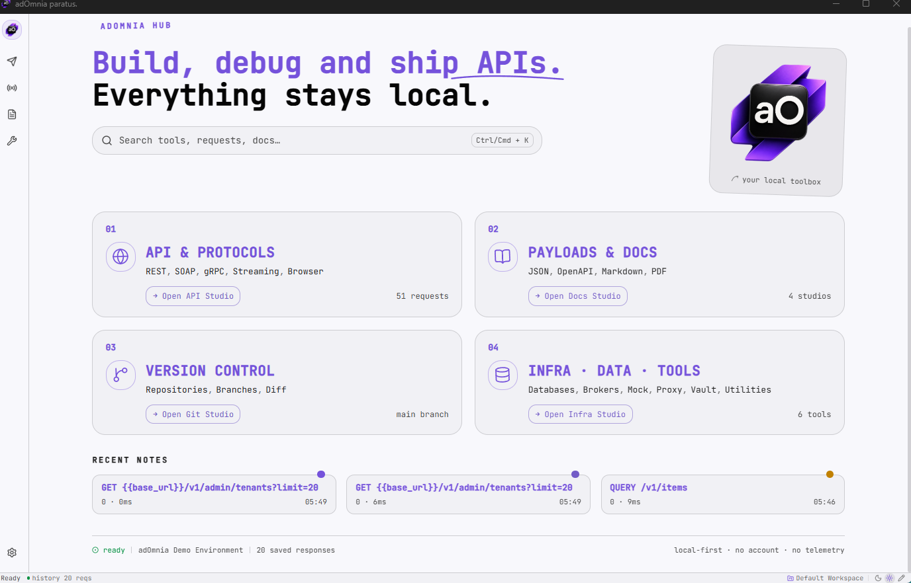

# adOmnia

**Everything you need to build, debug, and test APIs — in a single desktop app. No account. No cloud. 100% local.**

> Proudly listed on **[Awesome Wails](https://github.com/wailsapp/awesome-wails)** and **[Awesome HTTP Clients](https://github.com/mrmykey/awesome-http-clients/tree/main)**.



[](https://www.adomnia-dev.com)
[](https://github.com/wailsapp/awesome-wails)
[](https://github.com/mrmykey/awesome-http-clients/tree/main)


---

## Languages · Idiomas · Lingue

[English](#english) · [Español](#español) · [Italiano](#italiano)

---

## English

### One toolbox. Every protocol.


or white skin: 




REST, SOAP, gRPC, WebSocket, SSE, GraphQL, Kafka, RabbitMQ, MQTT, Redis, NATS — adOmnia handles them all. Mock servers, proxy interception, browser debugging via CDP, database access, load testing, encrypted vault, secret scanner. Built with **Wails v2** (Go + React), compiles into a single portable binary. Zero Electron overhead.

| Area | Highlights |
|---|---|
| **API Workspace** | Collections, environments, variables, auth, scripts, assertions, cURL & OpenAPI import. |
| **Protocols** | SOAP/WSDL Studio, gRPC, WebSocket client & mock, SSE. |
| **Brokers** | Kafka, RabbitMQ, MQTT, Redis, NATS — produce, consume, inspect. |
| **Simulation** | Mock server, proxy/interceptor, record & replay, Docker Lab. |
| **Debugging** | Browser DevTools (CDP), HAR viewer, DNS, CORS, port scanner. |
| **Data & Security** | Database Studio, encrypted vault, secret scanner, cert tools (PEM/JKS). |
| **Customization** | Themes, skins, template marketplace, WASM plugins, Python SDK. |

Full catalog: [docs/adomnia-feature-catalog.en.md](docs/adomnia-feature-catalog.en.md)

### Principles

**Local-first.** Everything stays on your machine. **Privacy-first.** No account, no telemetry, no sync. **Extensible.** Themes, plugins, templates. **Enterprise-ready.** SOAP, WS-Security, mTLS, JKS, legacy protocols are first-class citizens.

### Download

Pre-built binaries — no Go, Node.js, or build tools needed.

**[Download latest release →](../../releases/latest)**

| Platform | File |
|---|---|
| Windows | `adOmnia-*-windows-amd64.exe` |
| macOS | `adOmnia-*-macos-universal.dmg` |
| Linux | `adOmnia-*-linux-amd64.tar.gz` |

CI builds: **Actions → Build Desktop Artifacts → latest run → Artifacts**.

### Build from source

```bash
git clone <repo-url> && cd adomnia
cd frontend && npm install && cd ..
wails dev          # dev mode with hot reload
.\build.ps1        # Windows
bash build/build-wails.sh linux  # Linux
```

Details: [docs/BUILD.md](docs/BUILD.md)

### Tech & structure

| Layer | Stack |
|---|---|
| Shell | Wails 2 |
| Backend | Go |
| Frontend | React 18, TypeScript, Vite, Zustand |
| Storage | bbolt, local files, portable `.adomnia` workspaces |
| Distribution | Single native binary (Windows/macOS/Linux) |

Import Postman, Insomnia, Bruno, OpenAPI workspaces. Drag & drop `.json`, `.yaml`, `.adomnia` files.

### Docs

[Install](docs/INSTALL.md) · [Build](docs/BUILD.md) · [Architecture](docs/ARCHITECTURE.md) · [Roadmap](docs/ROADMAP.md) · [FAQ](docs/FAQ.md) · [Privacy](PRIVACY.md) · [Security](.github/SECURITY.md)

### Contribute

Read [AGENTS.md](AGENTS.md) and [CLAUDE.md](CLAUDE.md). before starting. Keep changes focused, product-oriented. PRs welcome.

### License

MIT © Andrea Cavallo — [LICENSE.md](LICENSE.md).

---

## Español

### Qué es adOmnia

Toolbox desktop local-first para APIs, backend y protocolos. REST, SOAP, gRPC, WebSocket, Kafka, mock servers, proxy, browser debugging, base de datos — todo en una sola app. Sin cuenta, sin telemetría, sin nube.

| Área | Capacidades |
|---|---|
| **APIs** | Colecciones, entornos, variables, auth, scripts, cURL & OpenAPI import. |
| **Protocolos** | SOAP/WSDL, gRPC, WebSocket, SSE. |
| **Mensajería** | Kafka, RabbitMQ, MQTT, Redis, NATS. |
| **Debugging** | Proxy, HAR viewer, DevTools (CDP), DNS, CORS, port scan. |
| **Simulación** | Mock server, record/replay, Docker Lab. |
| **Datos** | Database Studio, vault cifrado, secret scanner, PEM/JKS. |
| **Customización** | Temas, skins, plugins WASM, SDK Python. |

### Principios

**Local-first.** Datos en tu máquina. **Privacidad real.** Sin telemetría ni cuentas. **Extensible.** Temas, plugins, plantillas. **Enterprise.** SOAP, certificados, brokers como ciudadanos de primera clase.

### Descarga

**[Descargar →](../../releases/latest)** — binarios precompilados, sin dependencias.

| Plataforma | Archivo |
|---|---|
| Windows | `adOmnia-*-windows-amd64.exe` |
| macOS | `adOmnia-*-macos-universal.dmg` |
| Linux | `adOmnia-*-linux-amd64.tar.gz` |

CI: **Actions → Build Desktop Artifacts → última run → Artifacts**.

### Build desde código

```bash
git clone https://github.com/Andrea-Cavallo/adOmnia.git && cd adomnia
cd frontend && npm install && cd ..
wails dev
.\build.ps1  # Windows
bash build/build-wails.sh linux  # Linux
```

Guía: [docs/BUILD.md](docs/BUILD.md)

### Docs

[Funcionalidades](docs/funzionalita.md) · [Build](docs/BUILD.md) · [Roadmap](docs/adomnia-roadmap-checkbox.md) · [FAQ](docs/FAQ.md) · [Privacidad](PRIVACY.md)

MIT © Andrea Cavallo — [LICENSE.md](LICENSE.md).

---

## Italiano

### Cos'è adOmnia

Toolbox desktop local-first per API, backend e protocolli. REST, SOAP, gRPC, WebSocket, Kafka, mock server, proxy, browser debugging, database — tutto in un'unica app. Niente account, niente telemetria, niente cloud.

| Area | Cosa offre |
|---|---|
| **API** | Collezioni, ambienti, variabili, auth, scripts, import cURL e OpenAPI. |
| **Protocolli** | SOAP/WSDL Studio, gRPC, WebSocket, SSE. |
| **Broker** | Kafka, RabbitMQ, MQTT, Redis, NATS. |
| **Debugging** | Proxy, HAR viewer, DevTools (CDP), DNS, CORS, port scan. |
| **Simulazione** | Mock server, record/replay, Docker Lab. |
| **Dati** | Database Studio, vault cifrato, secret scanner, PEM/JKS. |
| **Personalizzazione** | Temi, skin, plugin WASM, SDK Python. |

### Filosofia

**Local-first.** Dati sulla tua macchina. **Privacy-first.** Zero telemetria, zero account. **Estendibile.** Temi, plugin, template. **Enterprise-ready.** SOAP, certificati, broker first-class.

### Download

**[Scarica →](../../releases/latest)** — binari precompilati, nessuna dipendenza.

| Piattaforma | File |
|---|---|
| Windows | `adOmnia-*-windows-amd64.exe` |
| macOS | `adOmnia-*-macos-universal.dmg` |
| Linux | `adOmnia-*-linux-amd64.tar.gz` |

CI: **Actions → Build Desktop Artifacts → ultima run → Artifacts**.

### Build da sorgente

```bash
git clone https://github.com/Andrea-Cavallo/adOmnia.git && cd adomnia
cd frontend && npm install && cd ..
wails dev
.\build.ps1  # Windows
bash build/build-wails.sh linux  # Linux
```

Guida: [docs/BUILD.md](docs/BUILD.md)

### Docs

[Funzionalità](docs/funzionalita.md) · [Build](docs/BUILD.md) · [Roadmap](docs/adomnia-roadmap-checkbox.md) · [FAQ](docs/FAQ.md) · [Privacy](PRIVACY.md)

MIT © Andrea Cavallo — [LICENSE.md](LICENSE.md).

special thanks to: 
- https://github.com/albertize
- https://github.com/plunix
