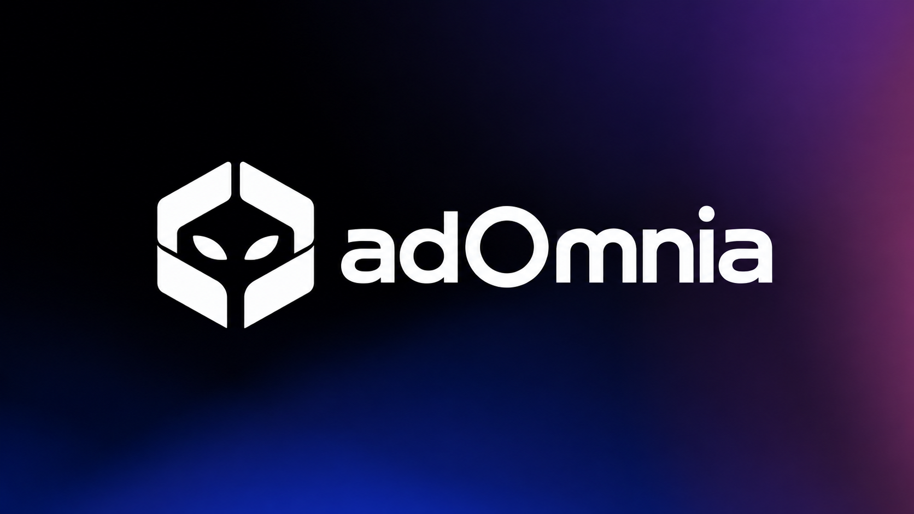
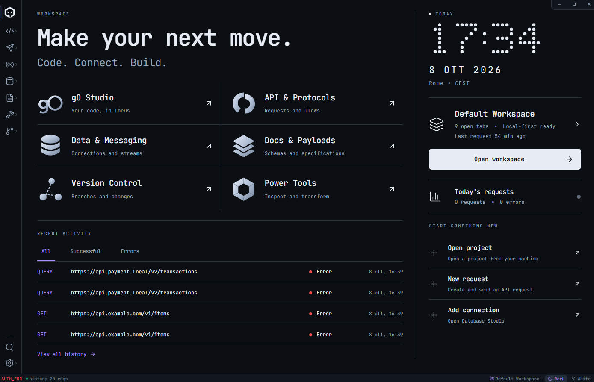
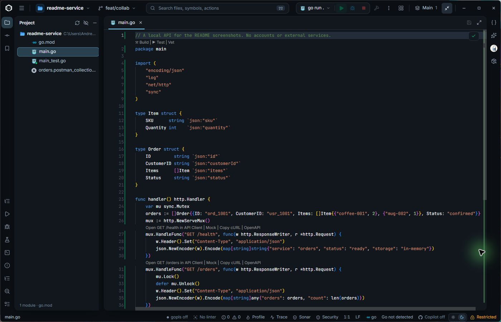
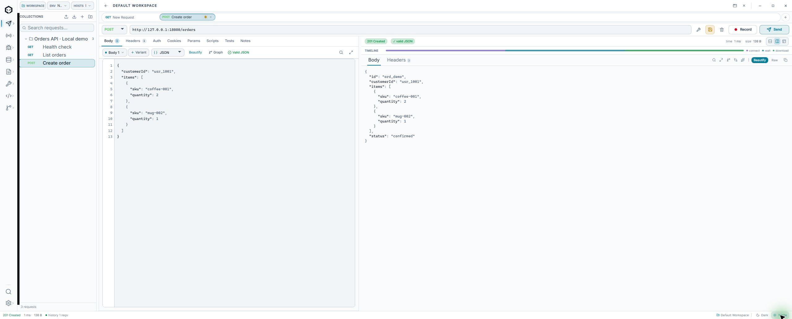
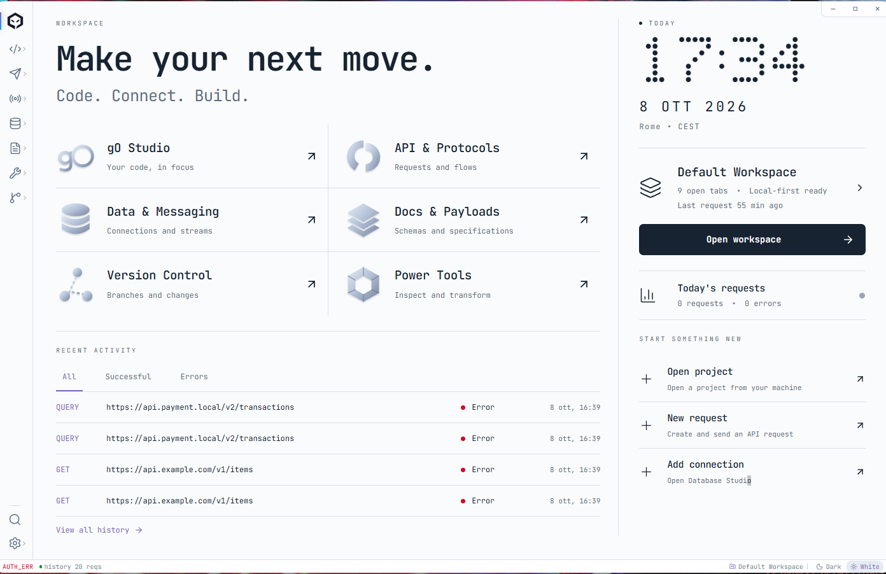
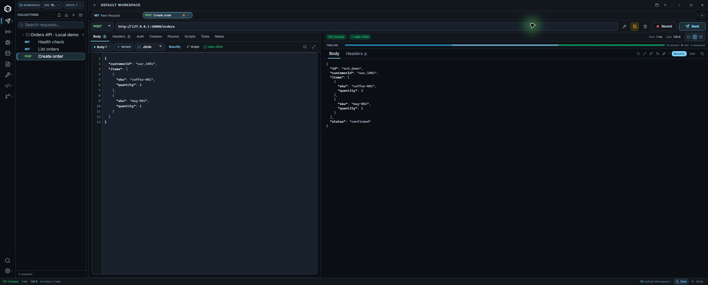

<p align="center">
  
</p>

<p align="center">
  <strong>A Go IDE and a complete API toolbox in one local-first desktop app.</strong><br>
  Write the service, run it, call it, debug it — and inspect its database, messages and logs without leaving the workspace.
</p>

<p align="center">
  <a href="https://github.com/Andrea-Cavallo/adOmnia/releases/latest"></a>
  <a href="https://github.com/Andrea-Cavallo/adOmnia/actions/workflows/build.yml"></a>
  <a href="LICENSE.md"></a>
  <a href="https://www.adomnia-dev.com"></a>
</p>

<p align="center">
  <strong>English</strong> · <a href="README.es-ES.md">Español</a>
</p>

<p align="center">
  <a href="#download">Download</a> ·
  <a href="#go-studio">gO Studio</a> ·
  <a href="#api-and-runtime-toolbox">API toolbox</a> ·
  <a href="#understand-your-code">Code insight</a> ·
  <a href="#command-line-and-ci">CLI</a> ·
  <a href="#building-from-source">Build</a> ·
  <a href="#documentation">Docs</a>
</p>

---

## Why adOmnia

Most developers juggle an IDE, an API client, a database GUI, a Kafka tool, a log viewer and a terminal. adOmnia puts them in one application where they share context: a Go service started in **gO Studio** becomes a **live session** that the API client, debugger, database explorer and log inspector all see.

- **Local-first.** No account, no telemetry, no cloud sync. Your data stays on your machine.
- **One workflow.** `code → running service → API request → breakpoint → code → response`.
- **Enterprise-ready.** SOAP/WSDL with WS-Security, mTLS with PEM and JKS, OAuth 2.0, AWS Signature v4, and proxies or VPNs on corporate PCs.
- **Cross-platform.** Windows, macOS and Linux, shipped as a single executable.
- **Side by side.** Any module — API Workspace, Database, Broker, Mock Server, Docker Lab — opens in its own native window, next to the code or on another monitor.



## Download

Get the latest build from **[GitHub Releases](https://github.com/Andrea-Cavallo/adOmnia/releases/latest)**.

| Platform | Artifact | Requirements |
| --- | --- | --- |
| Windows x64 | `adomnia-<version>-windows-amd64.exe` | WebView2 runtime |
| macOS (Intel and Apple Silicon) | `adomnia-<version>-macos-universal.dmg` | — |
| Linux x64 | `adomnia-<version>-linux-amd64-gtk3-webkitgtk-4.1.tar.gz` | GTK 3, WebKitGTK 4.1 |

Every release includes `SHA256SUMS.txt`. See the [installation guide](docs/INSTALL.md) for platform-specific steps. Package-manager templates for Scoop, Homebrew, Snap and Flatpak live in [`packaging/`](packaging/README.md); use GitHub Releases until those channels are published.

### Getting started

1. **Open a Go project:** in **gO Studio**, choose *Open Folder* on a folder with a `go.mod`, then trust it to enable gopls, Run, Debug and tests.
2. **Send a request:** in **API Workspace**, create a **New Request**, set method, URL, headers, authentication and body, then send it.
3. **Connect them:** run the service from gO Studio and use **Debug Request** to stop at your handler's breakpoint.

## gO Studio

gO Studio is the Go IDE built into adOmnia, designed for day-to-day Go work on real machines.



| Area | What you get |
| --- | --- |
| **Editing** | Completion, navigation, rename, Change Signature and other refactorings via gopls; diagnostics and quick fixes; golangci-lint, staticcheck and optional SonarQube; a three-way merge editor. |
| **Run and test** | Run from the gutter, a test explorer with coverage, Makefile targets, Dockerfiles and compose services, and a Run console that colours log levels. |
| **Debugging** | Delve with conditional, hit-count and function breakpoints, logpoints and Run to Cursor. A concurrency-first view groups goroutines by origin. |
| **Go insight** | Dependency graph with versions, licenses, updates and `govulncheck`; a visual `go.mod` editor; a `context.Context` propagation inspector. |
| **Workspace** | Git in the editor with a two-pane commit dialog, an integrated terminal, local history, crash recovery of unsaved buffers, and a modular layout where any tool can be moved, maximized or detached into its own window. |
| **Start everything** | *Run → Start Workspace* detects Compose files and `main` packages and starts the whole local environment as one compound run. |
| **Remote and cloud** | Run configurations target WSL distributions, SSH hosts or running containers. Kubernetes Studio covers pods, deployments, services, config maps and secrets (key names only), with Delve and pprof forwarded from a pod. |
| **Toolchain** | Uses the project's Go SDK, per-project `GOPROXY`, `GOPRIVATE`, `CGO_ENABLED`, `GOOS`/`GOARCH` and build tags; switching SDK restarts gopls; no silent toolchain downloads. |

**Trust model.** A newly opened project can be browsed and edited, but no Go tool, build or process runs against it until you trust it. See the [gO Studio guide](docs/GO-STUDIO.md).

### Understand your code

Static analysis built on Go's type information, without running the code:

- **Architecture Explorer:** import graph, calls between packages, call graphs around any function, entry points and services — `main`, HTTP routes, gRPC services, Kafka producers and consumers — plus data access per table for database/sql, sqlx, pgx and GORM.
- **REST routes from the code:** route groups, handlers, middleware and request/response DTOs, with *Open in API Client*, *Mock*, *Copy cURL* and *OpenAPI* lenses above every route.
- **Interface Explorer** and **Error Handling Intelligence:** implementations and near-misses, ignored or shadowed errors, `%v` instead of `%w`, `==` instead of `errors.Is`.
- **Context propagation:** follows `context.Context` across packages and flags functions that drop it.
- **Documentation:** every package as `go doc` shows it, `.proto` services and messages, Mermaid diagrams in Markdown and ADRs from `docs/adr`.

### Measure and harden

- **Performance Studio:** pprof profiles from tests or straight from a running service's `/debug/pprof`, flame graph, call graph and per-line cost in the editor gutter; reports exportable as Markdown for an AI assistant.
- **Go Trace:** execution traces read locally with Go's own parser — goroutines, GC, scheduler latency and blocking.
- **Benchmarks and fuzzing:** compare benchmarks with the previous run, `main` or any commit; the Fuzzing Studio lists targets and corpus, replays inputs and promotes failures to tests.
- **Coverage:** gutter coverage, patch coverage and the total compared with the base branch in a temporary worktree.
- **Security:** `govulncheck` findings ranked by reachability with call paths, plus an offline code scan for hardcoded secrets, weak TLS and crypto, and injection risks.

### AI in the editor

GitHub Copilot, Claude Code, [milk](https://github.com/scoutme/milk) (cheap/deep agent routing over ACP) and the a0 assistant sit beside the editor and receive the open file, unsaved changes included. Right-click actions explain code and errors, generate tests, benchmarks, fuzz targets and docs, and look for race risks and goroutine leaks. *Analyze failure* turns a failed test into a reviewable prompt with its output and reproduction command. Database and Kafka actions read the project's real schema and topics. `.adomnia/aiignore` and the project AI policy decide what never leaves the machine.

### From code to runtime

Start a service with Run or Debug and it becomes a [Live Development Session](docs/LIVE-SESSION.md):

- **Debug Request** starts the service under Delve if needed, waits for its port, sends the request and stops at your breakpoint, with code and request side by side.
- **Request ↔ handler:** the API Workspace shows the Go handler serving a request; a CodeLens on the handler opens, runs or debugs it.
- **Everything one request touched:** the SQL queries (with timing, row counts, slow statements and N+1 hints), Kafka messages and log lines a request caused appear next to its response.
- **Runtime enrichment:** gO Studio overlays what actually ran — routes, datasources, topics, latency, errors — on the static dependency picture.

## API and runtime toolbox



| Area | Summary |
| --- | --- |
| **API client** | REST and GraphQL, environments and variables, OAuth 2.0, AWS Signature v4, Digest and more, pre/post scripts, assertions, history, code generation; Postman, Insomnia, Bruno, cURL and OpenAPI import; an OpenAPI editor with governance rules. |
| **Testing and flows** | Collection runner with CSV datasets, recorded or AI-assisted flows, extracted variables, failure branches, contract checks and flow load tests. |
| **Protocols and brokers** | SOAP/WSDL with WS-Security, gRPC (including streaming), WebSocket, SSE, Kafka, RabbitMQ, MQTT, Redis Pub/Sub and NATS. |
| **Mocking and traffic** | Schema-based mocks, conditional expectations, record/replay, HTTPS interception with breakpoints and map local/remote, throttling, HTTP/gRPC load testing and a local Docker lab. |
| **Debugging** | Browser debugging through the Chrome DevTools Protocol, an application log inspector, HAR viewer, network diagnostics and redacted evidence export. |
| **Data and documents** | SQLite, PostgreSQL, MySQL and MongoDB explorers; Markdown, Mermaid and LaTeX; PDF annotation, forms and digital signatures. |
| **Git** | Clone, staging, commits, history graph, branches, merge, push/pull, conflict resolution and collections exported to a reviewable folder layout. |
| **AI and MCP** | Optional cloud or local models, the a0 assistant, GitHub Copilot, Claude Code and milk in gO Studio, a local agent gateway, an MCP client and an MCP server generator. |
| **Security and customization** | Encrypted vault, private environments, certificate tools, JavaScript and sandboxed WASI plugins (optionally signed), templates, themes and a personal accent colour. |

The [feature catalog](docs/adomnia-feature-catalog.en.md) describes every module.

## AI

AI features are optional and stay disabled until a provider is configured in **Settings → AI Engine**. Supported providers: Anthropic, Amazon Bedrock, OpenAI, Google Gemini, DeepSeek, Hugging Face, Ollama and OpenAI-compatible endpoints.

Keys are read from environment variables (`ANTHROPIC_API_KEY`, `OPENAI_API_KEY`, `GEMINI_API_KEY`, `DEEPSEEK_API_KEY`, `HF_TOKEN`, `ADOMNIA_AI_API_KEY`…), adOmnia environments or `.env` files, with the encrypted vault as fallback. Amazon Bedrock uses the standard AWS credential chain. Files listed in `.adomnia/aiignore` and secrets detected in code are never sent.

## Data and privacy

- No account, no telemetry, no automatic cloud sync.
- Editing and inspection work offline; network traffic goes only to endpoints you call.
- Cloud AI providers receive only the prompt and context you supply; Ollama or another local endpoint keeps inference on your machine.
- Local storage is not encrypted by default: keep secrets in the **encrypted vault**. Private environments are excluded from exports.

## Command line and CI

The desktop executable also runs headless.

```bash
# Run a collection and write a JUnit report
adomnia run ./my-collection --env prod --folder "Smoke" --reporter junit --out report.xml --bail

# Load-test a flow exported from the Flow Stress panel
adomnia stress ./checkout.stress.json --dataset users.csv --reporter junit --out stress.xml

# Lint an OpenAPI document
adomnia lint ./openapi.yaml --reporter json --out lint-report.json
```

Failed requests, assertions or thresholds return a non-zero exit code.

<details>
<summary>Environments and credentials in headless runs</summary>

- `--env <name>` loads `environments/<name>.json`; `--env-var KEY=VALUE` overrides a single variable.
- Precedence: collection variables, collection `.env`, named environment, CLI overrides.
- Supported: non-interactive OAuth grants, AWS Signature v4, a per-run cookie jar and multipart uploads.
- Interactive OAuth (authorization code/PKCE) requires the desktop app.
- Vault references resolve from `ADOMNIA_VAULT_<VARIABLE_NAME>` environment variables.

</details>

## Screenshots

<details>
<summary>Light and dark appearances</summary>





</details>

## Building from source

Requirements: Go 1.26.5, Node.js 22.13.0 or later, the Wails 3 CLI and the platform WebView development packages.

```bash
git clone https://github.com/Andrea-Cavallo/adOmnia.git
cd adOmnia
go install github.com/wailsapp/wails/v3/cmd/wails3@v3.0.0-beta.28
npm --prefix frontend ci
wails3 task dev
```

Production build and packaging:

```bash
wails3 task build
wails3 task package
```

Checks:

```bash
npm --prefix frontend test
npm --prefix frontend run build
npm --prefix frontend run check:startup
go vet ./...
go test ./...
```

See the [build guide](docs/BUILD.md) for native dependencies and release metadata.

## Documentation

| Document | Contents |
| --- | --- |
| [Installation](docs/INSTALL.md) | Downloads and platform setup |
| [Build](docs/BUILD.md) | Toolchain, native dependencies, packaging |
| [Feature catalog](docs/adomnia-feature-catalog.en.md) | Module-by-module reference |
| [gO Studio](docs/GO-STUDIO.md) | Go IDE usage, trust model, tools, shortcuts |
| [Live Development Session](docs/LIVE-SESSION.md) | Code ↔ running service ↔ API request |
| [Architecture](docs/ARCHITECTURE.md) | Application structure |
| [FAQ](docs/FAQ.md) · [Troubleshooting](docs/TROUBLESHOOTING.md) | Common questions and recovery |
| [Changelog](CHANGELOG.md) · [Release process](docs/RELEASE.md) | Changes by version and publishing |

## Contributing

Report bugs and propose changes through [GitHub Issues](https://github.com/Andrea-Cavallo/adOmnia/issues), including the app version, operating system and steps to reproduce. Remove credentials and private data from examples. Read [CONTRIBUTING.md](CONTRIBUTING.md) before submitting code, and report vulnerabilities privately as described in the [security policy](.github/SECURITY.md).

Thanks to [albertize](https://github.com/albertize) and [plunix](https://github.com/plunix) for their contributions.

## License

[MIT](LICENSE.md) · Copyright © 2027 Andrea Cavallo
