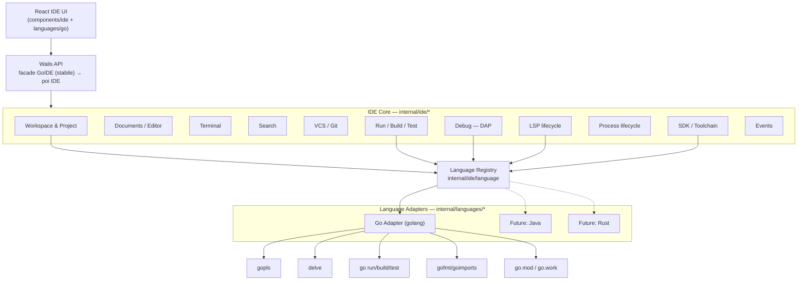
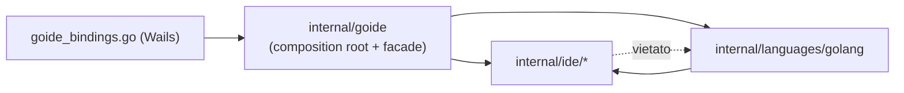
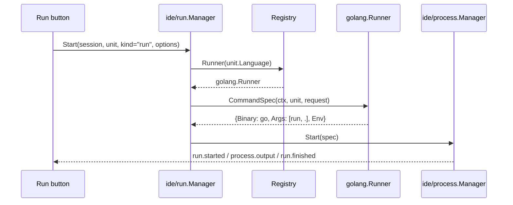
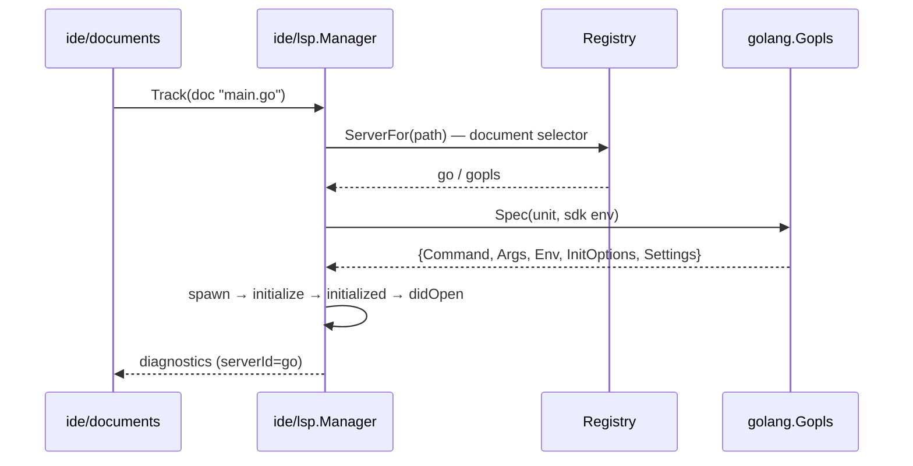

# gO Studio → adOmnia IDE Platform: refactor multi-language

> Stato: **Fasi 1–9 completate nel backend.** Run/Test sono orchestrati dal core e gli adapter possiedono comandi e parser. La UI multi-language (Fase 10) non è iniziata. Lo smoke nativo completo e le verifiche multipiattaforma restano in Fase 12. Ultimo aggiornamento: 2026-10-03.
> Obiettivo: trasformare gO Studio da "IDE Go" a **IDE Platform + Go Language Adapter**, senza
> riscritture e senza regressioni. Java/Rust/Python/TypeScript sono solo *scenari di validazione*:
> **non** si implementano in questo refactor.

Indice: [1 Architettura attuale](#1-architettura-attuale) · [2 Problemi](#2-problemi-identificati) ·
[3 Dipendenze Go nel core](#3-dipendenze-go-presenti-nel-core) · [4 Classificazione](#4-classificazione-generic--mixed--go_specific) ·
[5 Architettura target](#5-architettura-target) · [6 Diagrammi](#6-diagrammi) · [7 Package](#7-package-structure-proposta) ·
[8 Interfacce](#8-interfacce-principali) · [9 Language Adapter](#9-strategia-language-adapter) · [10 Registry](#10-language-registry) ·
[11 Workspace/Project](#11-modello-workspaceproject) · [12 LSP](#12-strategia-lsp) · [13 Debug/DAP](#13-strategia-debugdap) ·
[14 Run/Build/Test](#14-strategia-runbuildtest) · [15 SDK/Toolchain](#15-strategia-sdktoolchain) · [16 Migrazione](#16-piano-di-migrazione) ·
[17 Rischi](#17-rischi) · [18 Compatibilità](#18-compatibilità) · [19 Test plan](#19-test-plan) · [20 Acceptance](#20-acceptance-criteria)

---

## 1. Architettura attuale

### Numeri

| Area | Dimensione | Note |
|---|---|---|
| Backend `internal/goide` | ~70 file non-test, ~23k righe, 1 package | + `lsp/` (JSON-RPC, tipi, UTF-16), `dap/` (client DAP), `projecttemplates/` (solo `.tmpl` Go) |
| `internal/goidewindow` | 195 righe | finestre native per sessione (generico) |
| Binding Wails | `goide_bindings.go` (1417 righe) + `goide_p0_bindings.go` | servizio `GoIDE`, **213 metodi** esposti al frontend |
| Consumer esterni | `internal/copilot`, `copilot_bindings.go`, `devcontext_bindings.go`, `devsession_bindings.go` | usano `goide.Session`, `Document`, `DocumentID`, `EventEnvelope`, `Execution`, `Debug*` |
| Frontend | 215 file non-test in `components/goide`, 8 store `stores/goide*.ts`, 7 moduli `lib/goide-*.ts` | caricato in lazy (`MainArea.tsx:74`, `main.tsx:10`), garantito da `scripts/check-startup-bundle.mjs:22` |

### Forma attuale

```text
React (components/goide, stores/goide*)
        │  @wailsio/runtime + bindings/adomnia/goide.ts
        ▼
GoIDE (root binding, 213 metodi)  ──►  goide.Service (facade unica, service.go)
                                         ├─ WorkspaceManager   (sessioni + ispezione go.mod/go.work)
                                         ├─ DocumentManager    (file, quick open)
                                         ├─ ToolchainManager   (Go SDK, go env)
                                         ├─ ProcessManager     (CommandSpec → exec)   ← già generico
                                         ├─ LSPManager         (lifecycle generico + gopls cablato)
                                         ├─ DebugManager       (DAP generico + dlv cablato)
                                         ├─ TestManager        (go test -json / test2json)
                                         ├─ RunConfigManager   (kind Go + make/docker/command)
                                         ├─ TerminalManager, Watcher, History, Recovery, Supervisor, VCS ← generici
                                         └─ Lint, Sonar, pprof, trace, codegen, move symbol, deps …
```

Punti di forza già presenti (da **preservare**, non riscrivere):

- `lsp/` e `dap/` importano **solo stdlib**: protocollo e trasporto sono già generici.
- `CommandSpec` + `ProcessManager.Start` (processes.go:31-48, :103) è un'astrazione di esecuzione già neutra, con hook `OutputTap`, `OnExit`, `OnStop`.
- Il lifecycle LSP in `lsp.go` (spawn, initialize/initialized, reopen, crash-restart con backoff, shutdown/exit, throttle diagnostics) è generico salvo configurazione gopls.
- Il lifecycle DAP in `debug.go` (connect, handshake, breakpoints, configurationDone, step/threads/stack/scopes/variables/disassemble, terminate) è generico salvo argv e argomenti Delve.
- Eventi: `EventEnvelope{Type, SessionID, ResourceID, Payload}` già esiste ed è instradato per sessione/risorsa.
- `Capabilities` (types.go:343) esiste già ed è letto dal frontend (`stores/goide.ts:400`), ma **non è usato da nessun componente**: è l'aggancio naturale per le capability per linguaggio.
- Il registry dei comandi frontend (`goStudioCommands.ts`) ha già un meccanismo di *availability con motivo* consumato da menu e Search Everywhere: basta un campo `requires`.

---

## 2. Problemi identificati

| # | Problema | Evidenza | Impatto multi-language |
|---|---|---|---|
| P1 | Il modello `Project` contiene campi Go | types.go:37-40 `GoModPath`, `GoWorkPath`, `Modules []GoModule`, `LooseGoDirs` | un progetto Maven/npm non è rappresentabile |
| P2 | Rilevamento progetto cablato | workspace.go:213-314 `inspectProject`, `discoverModules`, `readModulePath` | nessun punto di estensione per `pom.xml` / `Cargo.toml` |
| P3 | **Un solo language server per sessione** | lsp.go:90-93 `sessions map[SessionID]*lspSession` | un monorepo Go+TS non può avere gopls + tsserver |
| P4 | Filtro documenti LSP cablato | lsp_documents.go:16-29 `languageIDForPath` → solo go/go.mod/go.work | ogni altro file è scartato |
| P5 | Settings LSP tipizzati Go | lsp_types.go:46 `LanguageServerSettings{Gofumpt,Staticcheck,Vulncheck}`, lsp.go:509-531 `goplsSettings` | |
| P6 | Debug cablato su Delve | debug.go:217 `dlv dap --listen`, :38 handshake stdout, :299 `adapterID:"go"`, :518-546 launch args | Java Debug Adapter usa stdio/porta diversa |
| P7 | Comandi `go` assemblati in ~15 punti | service.go:640 `runCommandSpec`, tests.go:93, runconfig_params.go:83, dependencygraph.go:185, gowork.go:177, templates.go:200 … | nessun `Runner` sostituibile |
| P8 | `RunConfiguration`/`RunRequest` con campi Go | types.go:161-176 `GoArguments`, `BuildTags`, `GOOS`, `GOARCH`, `Race`, `Profile`, `DebugFlags`; :304-308 | config Java non esprimibile |
| P9 | Toolchain = Go SDK | toolchain.go:26 `ToolchainConfiguration{GoBinary}`, :31-63 `ToolchainInfo` = dump `go env`, :318 `GOTOOLCHAIN=local` | JDK/rustup non modellabili |
| P10 | "Tool locator" duplicato 5 volte | gopls.go:32, service_debug.go:27, lint.go:107, buildtools.go:391, sonar.go:~205 | ogni linguaggio lo ricopierebbe |
| P11 | Persistenza con schema Go | persistence.go:25-29 `Toolchains`, `GlobalToolchain`, `DetectedToolchains` | |
| P12 | Frontend: provider Monaco registrati solo per `'go'` | `goStudioLanguageFeatures.ts:26`, `goStudioSemanticFeatures.ts:20`, `goStudioCodeLens.ts:14`, `goStudioCodeVision.ts:9`, `goStudioDebugEditor.ts:214` | nessun completamento/hover per altri linguaggi |
| P13 | Frontend: registry comandi chiuso + menu "Go" fisso + switch `go.*` nel pannello | `goStudioCommands.ts:3-35,58-69,413-512`; `GoStudioPanel.tsx:444-491,538-618` | |
| P14 | Frontend: filtri per estensione `.go` sparsi | `goStudioLspSync.ts:23`, `goStudioSaveActions.ts:41`, `goStudioRunOnSave.ts:20`, `goStudioRunTargets.ts:46`, `GoStudioInspectionWidget.tsx:25` | |
| P15 | Frontend: tool window e status bar cablati | `GoStudioRunPanel.tsx:280-286`, `GoStudioToolStripes.tsx:42-49`, `GoStudioStatusBar.tsx:46-51,124,145` | |
| P16 | Layering frontend invertito | store che importano da `components/` (`goide.ts:2-3,63-64`, `goideLsp.ts:1-3`) | rende difficile separare core e linguaggio |
| P17 | Stato globale di package | toolversion.go:54 cache **non limitata e mai invalidata**; toolversion_cache.go:19 globale condivisa fra istanze `Service` | test e istanze multiple si influenzano |

---

## 3. Dipendenze Go presenti nel core

"Core" = tutto ciò che dovrebbe funzionare identico per un altro linguaggio. Dipendenze Go oggi dentro codice destinato al core:

| Componente core-destinato | Dipendenza Go | Dove |
|---|---|---|
| WorkspaceManager | parsing `go.mod`/`go.work`, ricerca `.go` | workspace.go:213-314 |
| Project / RecentProject / Recovery | `Modules[].ModulePath` nel fingerprint | types.go:37-40, recovery.go:82-92 |
| LSPManager | `goplsSettings`, stringhe "gopls", `clientInfo "adOmnia Go Studio"`, filtro linguaggio | lsp.go:201-230,455,458,509-531,573; lsp_documents.go:16 |
| LSP features | comandi `gopls.change_signature`, `gopls.doc`; classificazione usi con `go/ast` | lsp_features.go:167,370,500 |
| Quick definition | estrazione dichiarazione con `go/parser` | quick_definition.go:42-80 |
| DebugManager | argv `dlv`, handshake stdout Delve, launch args, `__debug_bin`, retry `call ` | debug.go:38,217,299,333,518-590,691,764 |
| Breakpoints | `runtime.gopanic`, regex hit-condition Delve | breakpoints.go:17,21,209,422 |
| RunConfig / StartRun | kind `run/build/test/vet/generate/install/tidy/go-tool`, validazione flag `go` | service.go:633-810; runconfig*.go |
| TestManager | `go test -json` args | tests.go:93-145 |
| ToolchainManager | `GoBinary`, `GOTOOLCHAIN=local`, `go.mod` directives | toolchain.go:26,221,287,318 |
| Terminal | bin Go anteposto al PATH | service_terminal.go:44 |
| Documents | tabella `languageByExtension`, `go.mod`/`go.sum`, `vendor` ignorato | documents.go:26,472,491 |
| CreateProject | `exec.LookPath("go")`, `go mod init` | service.go:170-204 |
| Persistence | schema toolchain Go | persistence.go:25-29 |

Import Go-specifici (oggi tutti nello stesso package `goide`, quindi "visibili" al core):
`golang.org/x/mod/{modfile,module,semver}`, `golang.org/x/tools/go/{packages,ast/astutil}`, `golang.org/x/exp/trace`,
`github.com/google/pprof/profile`, `go/{ast,parser,token,printer,format,types,version}`.

---

## 4. Classificazione GENERIC / MIXED / GO_SPECIFIC

### Backend (`internal/goide`)

**GENERIC** (~37 file): `processes.go`, `process_adapter_*.go`, `process_list.go`, `terminal.go`, `terminal_profiles*.go`,
`watcher.go`, `search.go`, `quick_open.go`, `files.go`, `fileops.go`, `documents.go`¹, `document_observer.go`,
`history.go`, `recovery.go`¹, `crashlock.go`, `supervisor.go`, `windows.go`, `studio_workspaces.go`,
`service_session_state.go`, `vcs.go`, `vcs_working_diff.go`, `lint_baseline.go`, `sonar.go`, `sonar_baseline.go`,
`buildtools.go` (make/docker/compose), `toolversion_cache.go`, `lsp_editor.go`, `lsp_hierarchy.go`, `lsp_markers.go`,
`lsp/*`, `dap/*`, `internal/goidewindow`.
¹ con un dettaglio Go da estrarre (tabella estensioni / fingerprint moduli).

**GO_SPECIFIC** (~31 file): `gopls.go`, `toolchain_detect.go`, `toolversion.go`, `dependencies.go`, `dependencygraph.go`,
`module_graph.go`, `gowork.go`, `private_modules.go`² , `goextratools.go`, `gotools.go`, `templates.go` (+ `projecttemplates/`),
`coverage.go`, `coverage_base.go`, `coverage_branches.go`, `affected_packages.go`, `changed_symbols.go`, `codegen.go`,
`move_symbol.go`, `move_symbol_text.go`, `usage.go`, `pprof.go`, `trace.go`, `race_reports.go`, `testrunner_events.go`,
`service_tests.go`, `lint_config.go`, `debug_goroutines.go`, `debug_defers.go`, `debug_goroutine_origin.go`, `debug_memory.go`.
² il credential helper git (:56-122) è generico.

**MIXED** (~30 file) — separazione proposta:

| File | Resta nel core | Va nell'adapter Go |
|---|---|---|
| `workspace.go` | sessioni, `OpenProject`, `resolveProjectRoot`, trust | `inspectProject`, `discoverModules`, `looseGoDirectories`, `readModulePath` → `ProjectDetector` |
| `types.go` | `Session`, `Document`, `Execution`, `EventEnvelope`, `Capabilities`, `SessionView` | `GoModule`, campi Go di `Project`/`RunConfiguration`/`RunRequest` → payload del linguaggio |
| `lsp.go` | spawn, handshake, restart, shutdown, diagnostics, server→client requests | `goplsSettings`, messaggi, `initializationOptions` → `LanguageServerSpec` |
| `lsp_documents.go` | sync didOpen/didChange/didSave/didClose | `languageIDForPath` → document selector del linguaggio |
| `lsp_features.go` | richieste LSP standard | `gopls.change_signature`, `gopls.doc`, `classifyUsages` |
| `lsp_types.go` | `LanguageServerStatus`, features, DTO editor | `GoplsInfo`, `LanguageServerSettings` Go |
| `service_lsp.go` | wrapper API | `DetectGopls`, env gopls, root GOROOT/GOMODCACHE |
| `quick_definition.go` | definizione via LSP | `declarationSource` (go/parser) |
| `debug.go` | DebugManager DAP | `dlv dap`, readiness Delve, launch args, `__debug_bin`, retry `call`, errori Delve |
| `breakpoints.go` | store/normalize/send/run-to-cursor | panic bp `runtime.gopanic`, regole Delve |
| `service_debug.go` | API breakpoint/step | detect/install Delve, `StartDebug` Go |
| `tests.go` | `TestManager`, lifecycle run | `testArguments` |
| `runconfig.go`, `runconfig_commands.go`, `runconfig_params.go`, `service_runconfig.go` | CRUD, ordine, compound, command, env file, porte, catene pre/post | kind Go, go-tool, GOOS/GOARCH/race/cover/profile, mapping kind→go |
| `service.go` | facade sessioni, eventi, `StartRun` dispatch | `CreateProject` Go, `runCommandSpec`, `validateGoArguments`, dipendenze |
| `toolchain.go` | config per sessione/globale, cache detection, merge environment | `GoBinary`, `GOTOOLCHAIN`, `readModuleDirectives` |
| `toolchain_install.go` | download, progress, estrazione zip/tgz | catalogo go.dev |
| `lint.go` | registry candidati, run, applicazione fix | golangci/staticcheck, install, parser `.go:line` |
| `integrations.go` | `PluginEventFor` | `serviceSignatures` (module path Go) |
| `persistence.go` | schema | blocchi toolchain Go → per linguaggio |
| `service_terminal.go` | API terminale | PATH con bin Go → `EnvironmentContributor` |
| `goide_bindings.go` | trasporto, stores, finestre | metodi Go (`DetectGopls`, `InstallDelve`, `StartGoTool`…) |

### Frontend (`components/goide`, `stores/goide*`, `lib/goide-*`)

~95 GENERIC · ~60 GO_SPECIFIC · ~60 MIXED. Principali:

- **GENERIC**: editor tabs/split/markdown/image, terminal (panel, view, bus, links base), quick open, find/replace, local history, bookmarks/navigation, VCS (gutter, branch, commit diff base, history), crash recovery, keymap/shortcuts, modal primitives, flame graph/timeline/vizkit, Sonar, Copilot, stores `goideNavigation/Vcs/Windows/Workspaces/Tests`.
- **GO_SPECIFIC**: Performance Studio (pprof), Go trace, goroutine/concurrency/context inspector, go.mod/go.work/dependencies/dependency graph, toolchain (config, switcher, installer), private modules, extra Go tools, change signature, implement interface, move symbol, benchmarks, race, codegen, HTTP routes, `goStudioExtraLanguages` (gosum/goasm).
- **MIXED (hotspot)**: `GoStudioPanel.tsx`, `goStudioCommands.ts`, `GoStudioCodeEditor.tsx` + provider Monaco, `stores/goide.ts`, `stores/goideLsp.ts`, `stores/goideDebug.ts`, `GoStudioRunPanel.tsx`, `GoStudioToolStripes.tsx`, `GoStudioStatusBar.tsx`, `GoStudioToolbar.tsx`, `GoStudioTestsPanel.tsx`, `goStudioTestTree.ts`, `GoStudioDebugSession.tsx`/`DebugVariables.tsx`, `GoStudioProjectTree.tsx`, `goStudioFileIcons.ts`, `GoStudioSettingsDialog.tsx`, `lib/goide-api.ts`.

---

## 5. Architettura target

**Principio**: Go è un *consumer* della piattaforma. Il core conosce *concetti* (progetto, unità, server di linguaggio, adapter di debug, runner, SDK); l'adapter Go conosce *strumenti* (go, gopls, dlv, go.mod).

Decisioni chiave (motivate, non speculative):

1. **Riuso prima di astrazione.** `lsp/`, `dap/`, `ProcessManager`, `TerminalManager`, `Watcher`, `History`, `Recovery` vengono *spostati* nel core, non riscritti.
2. **Capability = interfacce piccole.** Un linguaggio implementa solo quelle che supporta; le capability esposte alla UI si *derivano* con type assertion (nessun flag manuale da tenere allineato).
3. **Niente interfaccia `Formatter`/`Builder` separate.** Format passa già da LSP (`textDocument/formatting`); build è un *run kind*. Aggiungerle oggi sarebbe astrazione speculativa (KISS): si introducono quando un linguaggio le richiede fuori da LSP.
4. **Il servizio Wails `GoIDE` resta la facciata stabile** durante tutta la migrazione: 213 metodi, nomi invariati. La UI non si rompe a ogni fase. Una facciata `IDE` generica arriva solo quando il frontend ne ha bisogno.
5. **Composition root unica**: `internal/goide` diventa il punto in cui il core viene assemblato e l'adapter Go registrato. È l'unico package (oltre ai test) che importa sia core sia `languages/golang`.

---

## 6. Diagrammi

### 6.1 Architettura target



### 6.2 Direzione delle dipendenze (regola architetturale)



### 6.3 Flusso Run



### 6.4 Flusso LSP



---

## 7. Package structure proposta

Nota: `go` è una keyword, il package dell'adapter si chiama **`golang`**.

```text
internal/
├── ide/                       # IDE Core — MAI importa languages/*
│   ├── language/              # Language, capability interfaces, Registry, LanguageID, Capabilities()
│   ├── project/               # Project, ProjectUnit, detection orchestrator
│   ├── workspace/             # sessioni, studio workspaces, trust, windows ownership
│   ├── documents/             # DocumentManager, quick open, file ops, history
│   ├── process/               # CommandSpec, Manager, process adapters, process list
│   ├── terminal/              # PTY, profili shell
│   ├── watcher/               # fsnotify
│   ├── search/
│   ├── vcs/                   # wrapper su internal/git
│   ├── lsp/                   # (= attuale goide/lsp) + Manager keyed (session, server) + features standard
│   ├── dap/                   # (= attuale goide/dap) + DebugManager, breakpoints store
│   ├── run/                   # RunManager, RunConfig CRUD, kind generici (command, compound, make, docker)
│   ├── testing/               # TestManager + TestEventParser contract
│   ├── sdk/                   # SDK manager (config/cache/env merge), installer engine, ToolLocator
│   ├── recovery/              # recovery, crashlock, supervisor
│   ├── quality/               # lint baseline, Sonar (agnostico)
│   └── events/                # EventEnvelope, tipi evento
└── languages/
    └── golang/                # Go Language Adapter — importa ide/*
        ├── language.go        # Language + registrazione capability
        ├── detector.go        # go.mod / go.work / loose dirs → ProjectUnit
        ├── sdk.go             # go version / go env, catalogo go.dev, GOTOOLCHAIN
        ├── gopls.go           # LanguageServerProvider + settings + comandi gopls.*
        ├── delve.go           # DebugAdapterProvider + estensioni goroutine/defer/memory
        ├── runner.go          # run/build/vet/generate/install/tidy/go-tool
        ├── tester.go          # go test -json + test2json parser
        ├── modules.go dependencies.go workspace.go (go.work) private_modules.go
        ├── lint.go            # golangci-lint, staticcheck
        ├── coverage*.go race.go pprof.go trace.go codegen.go movesymbol*.go usage.go
        └── templates/         # projecttemplates
internal/goide/                # composition root + facade Service (resta come nome per compatibilità)
```

Il package `internal/goide` alla fine contiene solo: costruzione del `Service`, registrazione dell'adapter Go, metodi-facciata per i binding, persistenza e migrazioni di schema.

---

## 8. Interfacce principali

Contratto minimo (Go). Solo ciò che serve a un problema reale della migrazione.

```go
package language // internal/ide/language

type ID string

// Language è l'unica interfaccia obbligatoria.
type Language interface {
    ID() ID
    Name() string
}

// Capability opzionali: un linguaggio implementa solo ciò che supporta.

// ProjectDetector riconosce le unità di progetto del linguaggio sotto root (es. go.mod, pom.xml).
type ProjectDetector interface {
    DetectUnits(ctx context.Context, root string) ([]project.Unit, error)
}

// DocumentSelector decide quali file appartengono al linguaggio e il languageId LSP/Monaco.
type DocumentSelector interface {
    LanguageIDForPath(path string) (string, bool)
}

// LanguageServerProvider descrive come avviare il server; il lifecycle resta nel core.
type LanguageServerProvider interface {
    LanguageServer(ctx context.Context, unit project.Unit, env sdk.Environment) (lsp.ServerSpec, error)
}

// DebugAdapterProvider descrive l'adapter DAP; il protocollo resta nel core.
type DebugAdapterProvider interface {
    DebugAdapter(ctx context.Context, unit project.Unit, request dap.LaunchRequest) (dap.AdapterSpec, error)
}

// Runner traduce un run kind del linguaggio in un CommandSpec; il ProcessManager lo esegue.
type Runner interface {
    RunKinds() []run.Kind
    CommandSpec(ctx context.Context, unit project.Unit, request run.Request) (process.CommandSpec, error)
}

// TestRunner produce il comando di test e il parser dei suoi eventi.
type TestRunner interface {
    TestCommand(ctx context.Context, unit project.Unit, request testing.Request) (process.CommandSpec, testing.EventParser, error)
}

// SDKProvider rileva/configura il toolchain del linguaggio (Go SDK, JDK, rustup…).
type SDKProvider interface {
    DetectSDK(ctx context.Context, config sdk.Config) (sdk.Info, error)
    Environment(info sdk.Info, config sdk.Config) []string
}

// Capabilities è derivato, mai dichiarato a mano.
func CapabilitiesOf(l Language) Capabilities // type assertion su ciascuna interfaccia
```

Spec restituite dagli adapter (dati, non comportamento):

```go
type lsp.ServerSpec struct {
    ServerID              string            // "gopls"
    Command               string
    Args, Env             []string
    InitializationOptions any
    Settings              func(section string) any // workspace/configuration
    ExecuteCommands       []string          // comandi custom esposti (gopls.change_signature…)
}

type dap.AdapterSpec struct {
    AdapterID   string                       // "go"
    Command     string
    Args, Env   []string
    Transport   dap.Transport                // Stdio | TCPListen{ReadyPattern *regexp.Regexp}
    Launch      map[string]any               // argomenti launch/attach già costruiti
    ExplainError func(error) error           // messaggi utente specifici
}
```

---

## 9. Strategia Language Adapter

- L'adapter è un **valore** costruito con dipendenze iniettate (ToolLocator, SDK manager, process runner sincrono): niente stato globale.
- Le estensioni **solo Go** (goroutine overview, defer pendenti, origine goroutine, memoria, pprof, trace, move symbol, go.work, dipendenze) restano nell'adapter e sono esposte come **metodi dell'adapter** chiamati dalla facciata (oggi sono già metodi Wails distinti: nessun cambio di API).
- Per usare il DAP dalle estensioni Go, il core espone una `dap.Session` minimale (`Evaluate`, `Call(command, args)`, `Threads`): le funzioni Go (es. `runtime.curg._defer`) diventano client di quella interfaccia.
- **Scenario Java** (validazione): `languages/java/` implementerebbe `ProjectDetector` (pom.xml/build.gradle), `SDKProvider` (JAVA_HOME/JDK), `LanguageServerProvider` (JDT LS), `DebugAdapterProvider` (java-debug, transport TCP), `Runner` (mvn/gradle/java), `TestRunner` (surefire/JUnit XML). **Zero modifiche al core.**

---

## 10. Language Registry

```go
type Registry struct { /* mutex + ordine di registrazione */ }

func NewRegistry() *Registry
func (r *Registry) Register(l Language) error          // errore su ID vuoto/duplicato (fail-fast)
func (r *Registry) Get(id ID) (Language, bool)
func (r *Registry) All() []Language                     // ordine di registrazione, deterministico
func (r *Registry) ForPath(path string) (Language, string, bool) // via DocumentSelector
func (r *Registry) DetectUnits(ctx, root) ([]project.Unit, error) // fan-out su tutti i ProjectDetector
```

- **Non globale**: un'istanza per `Service`, iniettata nei manager. I test creano registry propri.
- **Nessuno switch per linguaggio** nel core: ogni decisione passa da `Get`/`ForPath`/type assertion.
- La facciata espone `Capabilities` esteso con `languages: [{id, name, capabilities, documentSelectorExtensions}]`, così la UI abilita comandi e provider Monaco per linguaggio.

---

## 11. Modello Workspace/Project

Mappatura con i concetti già esistenti (nessun concetto nuovo inutile):

| Target | Oggi | Note |
|---|---|---|
| **Workspace** | `StudioWorkspace` (studio_workspaces.go) | raggruppa più root aperte |
| **Project** | `Session.Project` (una root aperta, con trust) | resta l'unità di apertura, finestra e autorizzazione |
| **ProjectUnit** | `GoModule` / go.work / loose dirs | **nuovo**: unità di build di un linguaggio dentro la root |

```go
type Project struct {
    ID, Name, RootPath, RealPath string
    Authorization AuthorizationState
    Units []Unit            // Go: un'unità per go.mod; domani pom.xml, package.json…
}

type Unit struct {
    Language language.ID   // "go"
    Kind     string        // "module", "workspace", "loose"
    Root     string        // relativo alla root del progetto
    Name     string        // module path, artifactId, package name
    Manifest string        // go.mod, pom.xml…
}
```

Monorepo `backend/go.mod + gateway/pom.xml + frontend/package.json` = **un Project con tre Unit di tre linguaggi**: già rappresentabile senza campi nuovi.

**Compatibilità**: `GoModPath`, `GoWorkPath`, `Modules`, `LooseGoDirs` restano nel JSON (deprecati) finché il frontend legge `units`; sono *derivati* dalle Unit Go nella facciata, non dal core. Rimozione in Fase 11.

---

## 12. Strategia LSP

1. Spostare `goide/lsp` → `ide/lsp` (solo import path).
2. `LSPManager.sessions map[SessionID]*lspSession` → `map[serverKey]*lspSession` con `serverKey{Session, ServerID}`. Oggi esiste sempre un solo server (gopls): comportamento identico.
3. `languageIDForPath` → `registry.ForPath` (DocumentSelector dell'adapter). I file non coperti da nessun linguaggio restano esclusi come oggi.
4. `goplsSettings`, `initializationOptions`, messaggi, `clientInfo` → `golang.Gopls.LanguageServer()` restituisce `ServerSpec`. `clientInfo` diventa "adOmnia IDE".
5. Comandi custom (`gopls.change_signature`, `gopls.doc`) passano da `ExecuteCommands` della spec; le feature che li usano diventano metodi dell'adapter.
6. `classifyUsages` (go/ast) e `declarationSource` (go/parser) → hook opzionali dell'adapter (`UsageClassifier`, `DeclarationSource`); senza hook il core usa il risultato LSP grezzo.
7. Lifecycle (`start → initialize → initialized → didOpen/didChange → diagnostics → shutdown → exit`, crash restart) **non cambia**.

---

## 13. Strategia Debug/DAP

1. `goide/dap` → `ide/dap`; `DebugManager` e store breakpoint nel core.
2. Avvio adapter da `AdapterSpec`: `Transport` `Stdio` o `TCPListen{ReadyPattern}` (Delve: `DAP server listening at: (.*)`), `AdapterID`, `Launch`.
3. Delve-specifico → `languages/golang/delve.go`: detect/install, `launchArguments` (mode, `__debug_bin`, buildFlags, `-test.run`), retry `call `, `showRegisters` config, messaggi d'errore, panic breakpoint `runtime.gopanic`, regex hit-condition.
4. Modello UI generico: thread/stack/scope/variabili/watch/console. **Goroutine** = vista Go che arricchisce i thread (contribuzione frontend Go), non un concetto del core.
5. Attach/remote restano capability dell'adapter (`DebugAdapterProvider` riceve `LaunchRequest{Mode}`).

---

## 14. Strategia Run/Build/Test

- `ide/run.Manager` mantiene CRUD, ordine, compound, catene pre/post, env file, porte, segreti e i **kind agnostici** già esistenti (`command`, `compound`, `make`, `docker-*`).
- I kind di linguaggio (`run`, `build`, `test`, `vet`, `generate`, `install`, `tidy`, `go-tool`, `package`, `files`) sono dichiarati dal `golang.Runner` (`RunKinds()`), non da `supportedRunKinds` globale.
- `RunConfiguration`/`RunRequest`: i campi Go (`GoArguments`, `BuildTags`, `GOOS`, `GOARCH`, `Race`, `Coverage`, `Profile`, `DebugFlags`, `ExtraTargets`) si spostano in `LanguageOptions json.RawMessage` posseduto dall'adapter. **Migrazione nel loader**: config persistite con campi piatti vengono convertite al primo caricamento; la facciata continua ad accettare il formato piatto finché il frontend non migra.
- Test: `ide/testing.Manager` + `TestRunner` dell'adapter (comando + `EventParser`). `testrunner_events.go` (test2json) è il parser Go; l'albero `testTree` resta generico.
- Validazioni (`validateGoArguments`: `-o`, `-overlay`, `-modfile`) restano nell'adapter: sono sicurezza specifica di `go`.

---

## 15. Strategia SDK/Toolchain

- `ide/sdk.Manager` = l'attuale `ToolchainManager` reso per linguaggio: config per (sessione, linguaggio) + globale, cache detection con generation counter, notifier, **merge environment** (OS + config + override + `netpolicy.ProcessEnvironment`).
- `sdk.Info` generico: `Available, Version, Binary, Scope, Warning, Error, Cached, BinaryStamp` + `Details any` (per Go: GOROOT, GOPATH, GOPROXY, GOPRIVATE, GOMODCACHE, GOFLAGS, directive…).
- `ide/sdk.Installer` = motore download/verifica SHA-256/estrazione zip/tgz/progress (già generico in toolchain_install.go:345-590); il **catalogo** (go.dev releases) è dell'adapter.
- **`ToolLocator`** generico (custom → managed toolsRoot → directory extra del linguaggio → PATH, con cache versione): elimina le 5 copie (P10). Go fornisce `GOBIN`/`GOPATH/bin` come directory extra.
- `GOTOOLCHAIN=local`, bin Go anteposto al PATH di terminale e gopls → `EnvironmentContributor` dell'adapter Go.

---

## 16. Piano di migrazione

Regole per **ogni** fase: compila, `go test ./...` verde, `npm run build` + `vitest` + `check:startup` verdi, binding rigenerati con il `wails3` pinnato in `go.mod`, gO Studio usabile. Nessuna fase cambia l'API Wails se non dichiarato.

- [x] **Fase 1 — Assessment.** Mappa GENERIC/MIXED/GO_SPECIFIC backend e frontend (questo documento).
- [x] **Fase 2 — Astrazioni core.** `internal/ide/language` (`Language`, `ProjectDetector`, `CapabilitiesOf`) e `internal/ide/project` (`Unit`, `IgnoredDirectory`, `EnsureWithin`). Test architetturale di import (`internal/ide/architecture_test.go`) + linguaggi fittizi (`registry_test.go`). Le altre capability (§8) entrano nella fase che porta il loro primo consumer.
- [x] **Fase 3 — Language Registry.** `language.Registry` (non globale, fail-fast su ID duplicati/non validi), composition root `internal/goide/languages.go`, iniettato nel `WorkspaceManager`. *L'estensione della facciata `Capabilities` con `languages` è spostata alla Fase 10, dove ha il primo consumer (UI).*
- [x] **Fase 4 — Project detection Go.** Scansione `go.mod`/`go.work`/cartelle sciolte spostata in `internal/languages/golang/detector.go` (stessi limiti e ordinamento); `Project.Units` popolato; campi legacy (`GoModPath`, `GoWorkPath`, `Modules`, `LooseGoDirs`) derivati dalle Unit in `goide.applyGoUnits` e coperti da test di equivalenza. Limite noto: una scansione del disco per linguaggio (walk condiviso quando i detector saranno più d'uno).
- [x] **Fase 5 — SDK/Toolchain.**
  - [x] `internal/ide/process`: adattamento processi per piattaforma (process group, console nascosta, kill dell'albero, shell predefinita).
  - [x] `internal/ide/sdk`: ambiente dei processi (validazione, credenziali mai persistite, merge con proxy/CA/offline), risoluzione eseguibili, `BinaryStamp`, query informative, download con SHA-256 ed estrazione zip/tgz sicura.
  - [x] SDK Go nell'adapter: `golang/sdk.go` (manager config/ambiente/`GOTOOLCHAIN`), `sdk_detect.go` (`go version`/`go env`), `sdk_install.go` (catalogo go.dev). Il manager è `ToolchainManager[K ~string]`: l'host lo istanzia con il proprio `SessionID`, senza toccare i call site. `goide/toolchain.go` contiene solo alias.
  - [x] Persistenza: **nessuna migrazione necessaria**. Il manager è per linguaggio, quindi lo schema Go resta identico; un linguaggio futuro salverà il proprio SDK sotto una chiave nuova.
  - [x] Localizzatore unico (`sdk.ToolSearch` + `sdk.Locate`, cache versioni `sdk.CachedVersion`) per gopls, Delve, linter e Sonar (P10). `make` resta a parte: il binario personalizzato esclude gli altri e non ha versione, forzarlo nello stesso schema sarebbe un'astrazione sbagliata. Fatto nella Fase 7.
- [x] **Fase 6 — LSP generico.**
  - [x] `goide/lsp` → `ide/lsp` e `goide/dap` → `ide/dap` (protocollo e trasporto, solo stdlib; anche `internal/copilot` li usa da lì).
  - [x] `LSPManager` con **un server per (sessione, linguaggio)**: `Start`/`Status`/`Log`/`Stop` ricevono il linguaggio; le operazioni su un documento usano il server che lo ha sincronizzato (`forDocument`); quelle di sessione girano su tutti i server (`WorkspaceSymbols` unisce i risultati, `ResolveCodeAction` trova il server che ha proposto l'azione, `ExpandHierarchy` usa il linguaggio del file, `NotifyWatchedFiles`/`StopSession`/`CloseSession` su tutti).
  - [x] Il lifecycle non conosce gopls: nome, opzioni di `initialize`, risposta a `workspace/configuration` e file osservati arrivano da `LanguageServerOptions`; `clientInfo` è "adOmnia IDE". La configurazione gopls (`goplsServerOptions`, `goplsSettings`) è nell'host in attesa della Fase 7.
  - [x] Capability `DocumentSelector` + `Registry.ForPath`: sostituisce lo switch `.go/go.mod/go.work` (implementata dall'adapter Go in `golang/documents.go`).
  - [x] `LanguageServerStatus.language` (additivo, per la UI della Fase 10).
  - [x] Test: due server per due linguaggi nella stessa sessione (`lsp_multiserver_test.go`), `ForPath` con linguaggi fittizi; regressione verificata con gopls e Delve reali (integrazione LSP, refactoring, gerarchie, crash restart, debug).
  - Limite noto: gli eventi `lsp.status` restano indicizzati per sessione; con più server la UI dovrà distinguerli per `language` (Fase 10).
- [x] **Fase 7 — gopls nell'adapter.**
  - [x] `lsp.ServerSpec` nel core (`LanguageServerOptions` nell'host è un alias).
  - [x] `golang/gopls.go`: `LocateGopls`, `GoplsInfo`, `GoplsSettings`, `GoplsServerSpec` (configurazione, ambiente di default, file osservati), costanti dei comandi `gopls.*`; `golang/delve.go`: `LocateDelve`, `DelveInfo` (anticipo della Fase 9 per la sola ricerca).
  - [x] Capability `UsageClassifier` e `DeclarationExtractor` nel core; Go le implementa con `go/ast` (`golang/usage.go`, `golang/declaration.go`). Usages e Quick Definition le usano tramite il registry: un linguaggio senza capability riceve il risultato LSP grezzo.
  - [x] Wails conserva gli alias Go come alias TS: il frontend non cambia (`LanguageServerSettings` = `golang.GoplsSettings`).
  - Scelta: **nessuna interfaccia `LanguageServerProvider` per ora.** L'unico consumatore sarebbe l'host, che chiama `golang.GoplsServerSpec` con impostazioni tipizzate Go; un provider generico richiederebbe impostazioni opache senza un consumatore reale. Entra nella Fase 10, quando la UI avvierà i server per linguaggio dalla facciata generica.
- [x] **Fase 8 — Run/Build/Test (backend completato).**
  - [x] `ide/run.ProcessManager`: lifecycle, process tree, stdin, output UTF-8, limiti, storico, stop e shutdown. `SessionID`, `RunID`, `Execution`, `CommandSpec` e modelli comuni nel core; alias di compatibilità in `goide`.
  - [x] `ide/run.Manager`: CRUD, ordine, isolamento per sessione, import condiviso e redazione segreti. `Configuration` contiene `LanguageOptions` opaco e nessun campo Go. La normalizzazione specifica è iniettata dall'host.
  - [x] Capability `Runner` / `TestRunner` derivata dal registry. `golang.Language.CommandSpec` dichiara i kind Go; eliminato `supportedRunKinds`. `golang.TestCommand` costruisce il comando strutturato e fornisce il parser.
  - [x] `golang.RunOptions` e conversione dei campi legacy in lettura/nel manager; facciata e file condivisi continuano a leggere/scrivere i campi piatti per il frontend attuale. Test di caricamento legacy, round-trip opaco e segreti; validazione dei percorsi anche nei target extra delle opzioni opache.
  - [x] `ide/testing.Tree` aggrega eventi neutrali; `golang.Test2JSONParser` possiede JSON, benchmark, shuffle, timeout e riferimenti ai sorgenti Go. Builder e validazione dei flag Go nell'adapter.
  - [x] `ide/testing.Manager` possiede avvio, framing stdout, albero, snapshot/output, storico limitato, isolamento e pubblicazione progressiva/finale. Gestisce anche la coda senza newline e registra l’identità prima della callback di fine. Hook iniettati per metadati specifici: `golang.RaceCollector` e risoluzione sorgenti Go nell’adapter; coverage e conversione dei modelli Wails nel layer di compatibilità dell’host. Test su 23 run, storico di 20, isolamento degli snapshot, chiusura sessione e un solo evento finale.
  - [x] `ide/run.Chain` / `Compound`, parametri comuni, env file, controllo porte e comandi generici nel core. `run.Tools` possiede Make, Docker build/run/compose e stop dei container; l’host inietta il percorso Make, autorizzazione e aggiornamento della richiesta per Rerun. `golang.ApplyRunOptions` / `ValidateRunOptions` possiedono GOOS/GOARCH, race, coverage e profiling. Gli identificatori persistiti e la label Docker legacy restano compatibili.
  - [x] Run/Test scelgono capability dal registry; gli ambienti non-Go e Make/Docker/command/binary usano il preparatore comune senza selezione SDK Go. Runner fittizio reale con PATH privo di Go: apertura progetto/documento, configurazione salvata con opzioni opache, env file/precedenza esplicita/porta, Run via facade e `run.Manager`, Test con parser neutrale, storico/output e `command`. Anche le opzioni Go opache applicano flag/ambiente e coverage; package test opachi confinati al progetto. La migrazione UI resta in Fase 10, la rimozione dei campi piatti in Fase 11.
- [x] **Fase 9 — Debug/Delve (implementazione backend verificata automaticamente).**
  - [x] `ide/dap.DebugManager` e store breakpoint nel core: nessun import dell'host o dell'adapter. Thread, stack, scope, variabili, watch, console, stepping e disassembly parlano solo DAP.
  - [x] `dap.AdapterSpec` fornisce ID, eseguibile, argomenti, ambiente, directory, titolo, launch/attach e hook per errori/evaluate/panic. Trasporti `Stdio` e `TCPListen` con pattern di readiness configurabile; remoto senza processo locale. Validazione della spec prima dello spawn, stderr separato dal protocollo stdio, chiusura di stream/processi e cleanup.
  - [x] `golang.DebugAdapter`: argomenti `dlv dap`, launch/test/attach/remoto, binario temporaneo per piattaforma, build flag, titoli e spiegazioni SDK/Delve. Retry `call ` solo per REPL; watch e hover non eseguono chiamate implicitamente. Hit-condition e `runtime.gopanic` restano Go-specifici.
  - [x] `golang.DebugExtensions` usa `dap.Session` per goroutine, origine, defer, lettura memoria via evaluate e registri. L'host conserva wrapper e alias, senza copie della logica Go.
  - [x] Adapter fittizio senza Go/Delve su PATH: handshake e operazioni reali sui due trasporti, ID e readiness diversi da Go, stderr, disconnect e spec invalide. Regressioni Delve reali: breakpoint condizionali/hit count/logpoint/funzione/panic, Run to Cursor, step/variabili/evaluate, test singolo, isolamento sessioni, attach/detach, remoto, disassembly, memoria, goroutine/defer e stop senza orfani.
  - [x] Binding rigenerati con Wails `v3.0.0-beta.26`; adattato il wrapper TS al tipo delle goroutine derivato dai modelli generati, senza modificare la UI.
  - [ ] Smoke manuale della nuova build: `wails3 task dev` ha compilato e avviato il binario, ma l'istanza già aperta ha intercettato l'avvio per il vincolo single-instance. Nessun claim di osservazione della nuova build; resta nella validazione di Fase 12.
- [ ] **Fase 10 — UI.** `frontend/src/components/ide/` (generico) + `components/ide/languages/go/` (contribuzioni: comandi, menu, tool window, status bar, provider Monaco, impostazioni). Command `requires`, tool-window registry, provider Monaco per `languageId` dal backend. Aggiornare la regex di `scripts/check-startup-bundle.mjs`.
- [ ] **Fase 11 — Accoppiamento residuo.** Rimozione campi legacy (`Project.GoModPath`…, run config piatti), stato globale (toolversion caches → istanza), layering store→components.
- [ ] **Fase 12 — Validazione.** Test architetturali, smoke manuale completo di gO Studio (`todo-ide.md`), aggiornamento `docs/GO-STUDIO.md`, `AGENTS.md`, `CLAUDE.md` (sezione "Add a Go Studio feature" → "Add a language/IDE feature").

Ordine scelto perché ogni fase sblocca la successiva con il minimo raggio d'azione: le Fasi 2-4 sono quasi solo additive; 5-9 spostano codice dietro interfacce già testate; 10 tocca la UI quando il backend espone già le capability.

---

## 17. Rischi

| Rischio | Prob. | Impatto | Mitigazione |
|---|---|---|---|
| Spostare tipi esposti a Wails cambia namespace dei modelli in `frontend/bindings` | Alta | Medio | spostare i tipi in blocchi coerenti per fase; i wrapper `lib/goide-*.ts` assorbono i nuovi import; rigenerare binding e `tsc` a ogni fase |
| Regressioni silenziose su gopls/Delve | Media | Alto | test di integrazione esistenti (`lsp_integration_test.go`, debug) sono il gate; smoke manuale per fase |
| Persistenza (bbolt `goide/state`) incompatibile | Media | Alto | loader con migrazione e test sul JSON reale della versione precedente; nessuna chiave rinominata |
| Cicli di import durante gli spostamenti | Media | Medio | test architetturale da Fase 2; composition root unica |
| Diff enormi in conflitto con lavoro parallelo (altri agenti/branch) | Alta | Medio | fasi piccole, commit per fase, spostamenti con `git mv` per conservare la storia |
| Astrazione prematura (interfacce senza secondo consumer) | Media | Medio | ogni interfaccia ha un consumer reale nel core + `FakeLanguage` nei test; niente Formatter/Builder finché non servono |
| Performance: più server LSP per sessione | Bassa | Medio | avvio lazy per linguaggio solo quando un suo documento viene aperto (come oggi gopls) |
| Startup bundle frontend | Media | Medio | moduli di linguaggio caricati in lazy; regex `check:startup` aggiornata nella stessa PR |

---

## 18. Compatibilità

- **API Wails**: il servizio `GoIDE` e i suoi 213 metodi restano invariati fino alla Fase 10; aggiunte solo additive.
- **Persistenza**: chiavi bbolt `goide/{state,recovery,supervisor,localHistory}` invariate; nuovi campi `omitempty`; migrazione in lettura del vecchio schema toolchain e run config.
- **File di progetto**: `.adomnia/*` (run config condivise, `sonar-baseline.json`, lint baseline, `aiignore`) invariati; run config condivise con campi Go piatti continuano a essere lette.
- **Consumer interni**: `copilot`, `devcontext`, `devsession` usano `Session`, `Document`, `DocumentID`, `EventEnvelope`, `Execution`, `Debug*`: restano nella facciata come alias finché i consumer non passano al core.
- **Plugin**: contratto eventi plugin v1 (`integrations.go:PluginEventFor`) invariato.
- **Piattaforme**: nessun cambio a build tag (`process_adapter_*`, `terminal_profiles_*`) se non spostamento di package.

---

## 19. Test plan

Architetturali (nuovi):

| Test | Come |
|---|---|
| Il core non importa adapter né librerie Go-tooling | `go list -deps ./internal/ide/...` non contiene `adomnia/internal/languages/`, `golang.org/x/mod`, `golang.org/x/tools`, `golang.org/x/exp/trace`, `github.com/google/pprof` |
| Nessun ciclo | `go build ./...` + `go vet ./...` |
| Registry con `FakeLanguage` | registra un linguaggio fittizio, `Get`/`ForPath`/`DetectUnits` funzionano, duplicati e ID vuoti rifiutati |
| Capability derivate | `FakeLanguage` che implementa solo `Runner` → `CapabilitiesOf` = solo Run |
| Core senza Go installato | Workspace/Documents/Run(command) funzionano con `PATH` senza `go` |
| Run via registry | `run.Manager` esegue un kind del `FakeLanguage` senza toccare il core |
| LSP multi-server | due server fittizi (stub JSON-RPC in-process) per due linguaggi nella stessa sessione |

Regressione Go (esistenti, devono restare verdi): detection `go.mod`/`go.work`, lifecycle gopls (`lsp_integration_test.go`), run/build/test, test2json, Delve, toolchain detect/install, persistenza/restore, recovery.

Frontend: `vitest` su registry comandi con `requires`, provider Monaco registrati per `languageId` fittizio, tool-window registry; `check:startup`.

Manuale (per fase): checklist di `todo-ide.md` — apertura progetto, completamento/hover/rename, run/test/debug con breakpoint, terminale, Git, Performance Studio.

---

## 20. Acceptance criteria

- [x] Il core (`internal/ide/...`) non importa `internal/languages/...` né librerie di tooling Go (test architetturale).
- [x] `internal/languages/golang` dipende dal core, mai il contrario; nessun ciclo.
- [ ] gO Studio funziona come prima (test esistenti + smoke manuale).
- [x] `Project` è composto da `Unit` multi-linguaggio; nessun campo Go nel modello core.
- [ ] Lifecycle LSP generico, più server per sessione; gopls è un `LanguageServerProvider` Go.
- [x] DebugManager parla solo DAP; Delve è un `DebugAdapterProvider` Go.
- [x] Run/Build/Test sono capability (`Runner`, `TestRunner`); i kind Go sono dichiarati dall'adapter.
- [ ] SDK/toolchain astratti (`ide/sdk`); `GOROOT/GOPATH/GOPROXY/GOPRIVATE` solo in `languages/golang`.
- [x] Esiste `language.Registry`; nessuno switch globale per linguaggio nel core.
- [ ] `FakeLanguage` registrabile e usabile nei test senza modificare workspace, editor, terminal, run, debug, LSP, explorer.
- [ ] Frontend: componenti IDE comuni senza `'go'` letterali; contribuzioni Go in `components/ide/languages/go/`.
- [ ] Tutti i test esistenti verdi + test architetturali nuovi; build Windows/macOS/Linux invariata.
- [ ] Aggiungere `languages/java` richiede solo un nuovo package e una riga di registrazione.

---

## 21. Verifica e pubblicazione delle prime nove fasi — 2026-10-03

Le Fasi 1–7 sono già nei commit `37f1e3e`, `4d00dbf` e `f4fd67b`. Questo incremento chiude le due osservazioni dell'audit LSP (argomenti di startup nella `ServerSpec`; richieste workspace/symbol parallele con timeout indipendenti e risultati parziali), pubblica le estrazioni Run/Test effettivamente realizzate e completa il backend DAP/Delve della Fase 9. **Alla pubblicazione di `daa2e89` la Fase 8 era ancora parziale.** Il completamento successivo è documentato nella sezione 22.

| Verifica eseguita | Esito / limite |
|---|---|
| `go build ./...` | PASS |
| `go test ./... -count=1 -timeout=240s` | PASS; `internal/goide` 155.462 s. PATH include gli strumenti Go gestiti; integrazioni reali gopls e Delve disponibili. |
| `go test ./... -short -count=1 -timeout=180s` | PASS; `internal/goide` 152.971 s. |
| `go vet ./...` | PASS; anche il controllo mirato core/adapter/host è verde. |
| Test architetturali core/adapter | PASS: core senza import dell'host, adapter o librerie di tooling Go; adapter senza import dell'host. |
| Nuove regressioni | PASS: argv LSP, server lento/risultati sani, DAP TCP e stdio, spec invalide, migrazione configurazioni legacy/opache, segreti, target/flag Go opachi confinati. |
| Generazione binding | PASS con CLI Wails `v3.0.0-beta.26`, coerente con `go.mod`; 17 servizi, 588 metodi, 315 modelli. |
| `npx tsc --noEmit` / `npm run build` | PASS dopo l'adeguamento del wrapper TS al modello goroutine generato. |
| `npm test` | PASS: 232 file, 1.035 test. |
| `npm run check:startup` sulla build corrente | PASS: 620.225 byte JS iniziali; nessun modulo deferred sullo startup. |
| `wails3 task dev` con CLI beta.26 | Compilazione frontend e binario Windows riuscite. Lo smoke della nuova build non è osservato: l'istanza già aperta ha intercettato l'avvio single-instance. |
| Altre piattaforme | Build macOS/Linux e relativo smoke non eseguiti in questo ambiente Windows. |

Dopo il completamento della Fase 8 (sezione 22), il prossimo lavoro è la Fase 10 (contribuzioni UI e capability per linguaggio), Fase 11 (alias/campi legacy/cache/store coupling) e Fase 12 (smoke completo e verifiche multipiattaforma). Il frontend corrente continua a essere Go Studio; non esiste ancora un workflow utente per un secondo linguaggio.

## 22. Completamento della Fase 8 — 2026-10-03

Implementazione pubblicata su `master`: [`fe3456a`](https://github.com/Andrea-Cavallo/adOmnia/commit/fe3456ac351ebae9ce7d8cbd76b2ca0b070df4e4). La Fase 9 e le basi Run/Test precedenti sono in `daa2e89`.

I tre residui di Fase 8 sono chiusi. Il core assume il lifecycle dei test e dei workflow Run; la facciata compone autorizzazione, documenti, registry, SDK Go solo per Go e metadati compatibili con Wails. Le API pubbliche e i JSON legacy non cambiano. Le configurazioni di altri linguaggi conservano `LanguageOptions` fino all’esecuzione e possono usare i kind dichiarati dal loro adapter, senza un elenco globale nel core.

Le nuove regressioni verificano il workflow con eseguibili reali, non solo la costruzione di argomenti: nessun Go nel PATH; runner e parser di un linguaggio fittizio; `.env` e porte; comando generico; identità delle run veloci; flush della riga finale; storico limitato e isolamento degli snapshot. Le opzioni Go opache sono coperte per race/coverage/profiling/GOOS/GOARCH e per i test con coverage reale e package confinati.

| Verifica | Esito |
|---|---|
| `go build ./...` / `go vet ./...` | PASS; controllo vet mirato ripetuto dopo l’ultima correzione delle callback. |
| `go test ./... -count=1 -timeout=240s` | PASS; host `internal/goide` 144.153 s, core testing 2.930 s; PATH include gopls e Delve gestiti. |
| Regressioni mirate `-race` | PASS: workflow senza Go, opzioni opache Go, storico/snapshot, catene e configurazioni, callback contemporanee build/container. Le ultime correzioni sono verificate anche dopo la suite generale. |
| Make reale | PASS; Docker reale SKIP per daemon non attivo. |
| Test architetturali core/adapter | PASS, compresi nella suite completa. |
| Binding Wails `v3.0.0-beta.26` | PASS: 17 servizi, 588 metodi, 315 modelli; contratti pubblici invariati. |
| `npx tsc --noEmit` / `npm run build` | PASS. Nessuna modifica funzionale alla UI. |
| `npm run check:startup` | PASS: 620.225 byte JS iniziali, nessun deferred sullo startup. |
| `git diff --check` | PASS. |

La callback che memorizza le richieste Make/Docker copia i dati per ogni invocazione: una build molto rapida e il container successivo non modificano più la stessa richiesta catturata. La regressione esegue entrambe le callback contemporaneamente e controlla separatamente le richieste di Rerun, anche con il race detector.

Limiti osservati: Make end-to-end passa; Docker end-to-end è saltato perché il daemon Docker Desktop non è attivo (costruzione comandi, percorsi e segreti sono coperti dai test). Nessuna verifica manuale della nuova build desktop o di macOS/Linux in questo incremento: restano nella Fase 12. Restano aperte soltanto le Fasi 10, 11 e 12.
